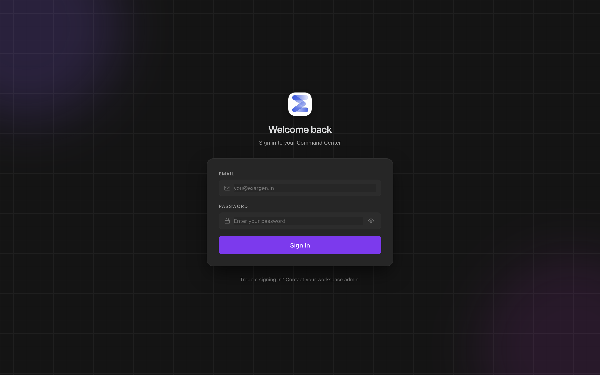
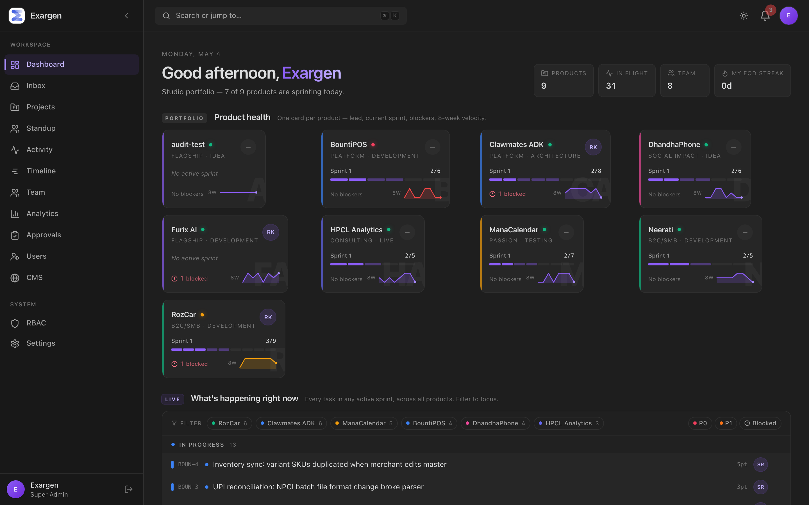
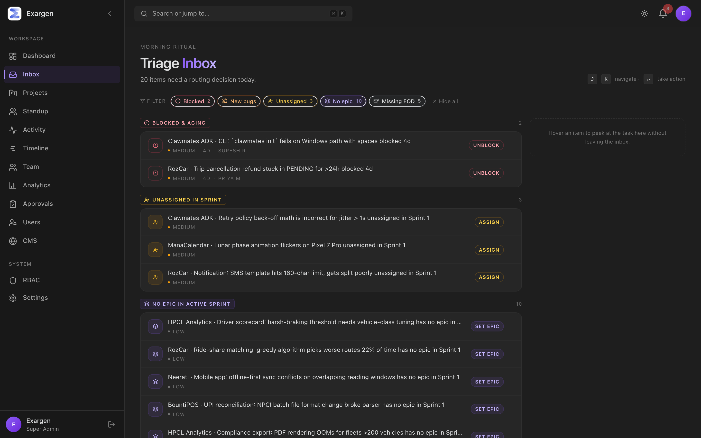
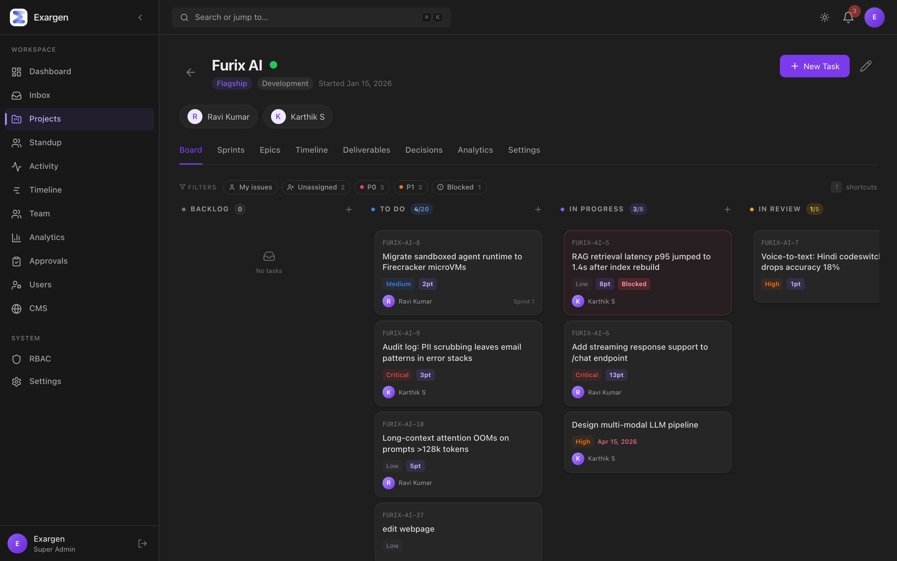
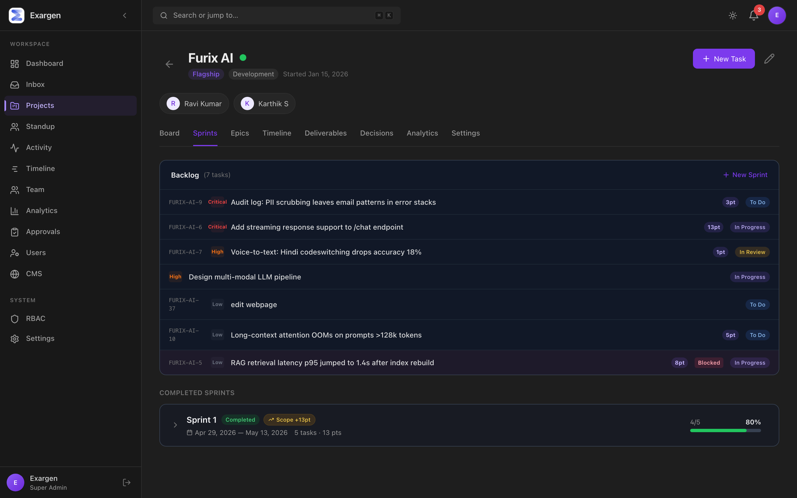
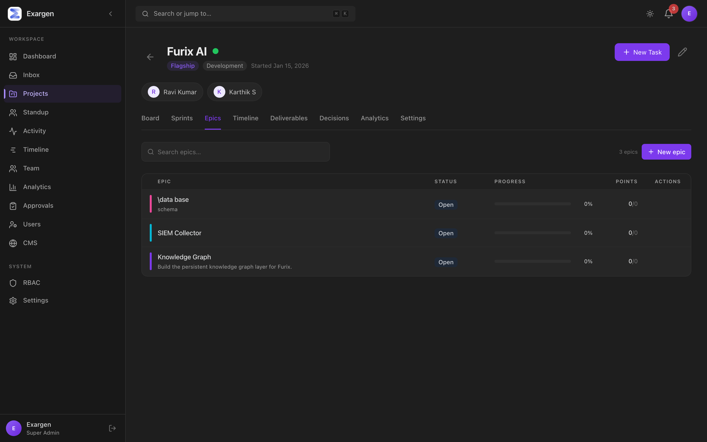
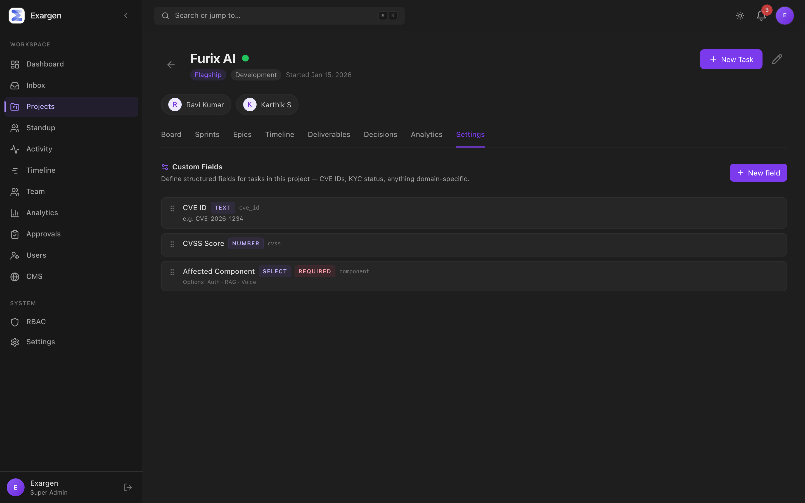
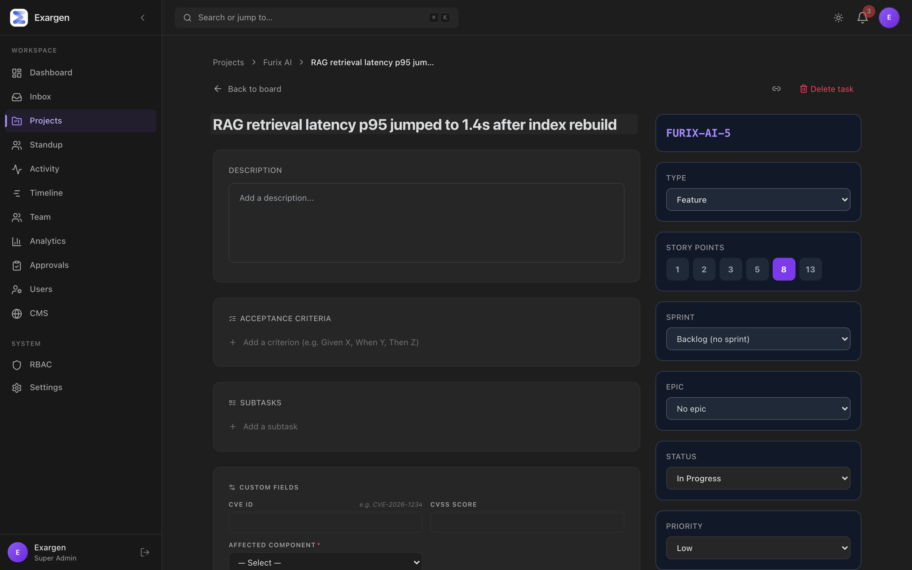
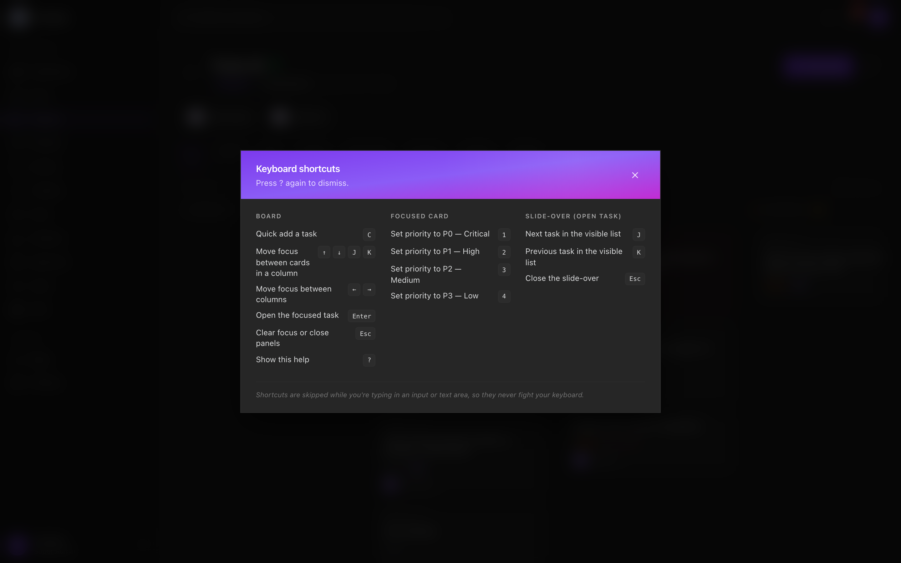

# Exargen Command Center — Product Guide

A single source of truth for everything we've built. Written so a 10-year-old
could follow it. Each section says what the thing is, what it's for, how it
compares to the industry-standard tool, and how to actually use it.

> **How to read this guide.** Skim the table of contents below. Open a section,
> look at the screenshot, then read the "What is it" / "How to use it"
> bullets. The "Industry comparison" line tells you what tool you'd otherwise
> reach for to do the same thing.

---

## Table of contents

1. [The big picture](#1-the-big-picture)
2. [Roles & who sees what](#2-roles--who-sees-what)
3. [Login & the dark Obsidian look](#3-login--the-dark-obsidian-look)
4. [Studio Portfolio (`/dashboard`)](#4-studio-portfolio-dashboard)
5. [Triage Inbox (`/inbox`)](#5-triage-inbox-inbox)
6. [Project workspace — the kanban board](#6-project-workspace--the-kanban-board)
7. [Sprints with retro & burnup](#7-sprints-with-retro--burnup)
8. [Epics — bodies of work](#8-epics--bodies-of-work)
9. [Project Settings — Custom Fields per product](#9-project-settings--custom-fields-per-product)
10. [Task detail — the issue page](#10-task-detail--the-issue-page)
11. [Keyboard shortcuts cheat sheet](#11-keyboard-shortcuts-cheat-sheet)
12. [Module ratings](#12-module-ratings)
13. [How to get started today](#13-how-to-get-started-today)
14. [Glossary](#14-glossary)

---

## 1. The big picture

Exargen Command Center is the operating system for running **8 products at once**
— Furix AI, Clawmates ADK, RozCar, ManaCalendar, DhandhaPhone, Neerati,
HPCL Analytics, BountiPOS. Founder, PMs, and engineers all sign in to the same
app and see the slice they need.

Think of it like a **building**:

- The **Studio Portfolio** (front door) tells you which products are healthy
  and which need attention.
- The **Triage Inbox** is the doormat — pile of decisions that need to be made
  this morning.
- Each **Project** is a room. Inside are tabs: Board, Sprints, Epics,
  Timeline, Deliverables, Decisions, Analytics, Settings.
- A **Task** is a single piece of work, with everything you need (status,
  who's on it, comments, sub-tasks, acceptance criteria, links to other tasks,
  per-product custom fields).

Industry analogy: imagine **Linear's speed** + **Jira's structure** +
**Notion's flexibility**, glued together for a multi-product studio.

---

## 2. Roles & who sees what

| Role | What they see | Compare to |
|---|---|---|
| **Super Admin / Admin** | Everything across the studio. Studio Portfolio, Triage Inbox, every project, every user, RBAC. | Jira "Site Admin" |
| **Product Manager** | Their projects' Board / Sprints / Epics / Timeline / Decisions / Settings. | Linear "Workspace Admin" |
| **Engineer** | Their dashboard, their tasks, their projects' boards, EOD form, Timesheet. | Linear member |
| **Client** | Read-only access to a single project's milestones, status, deliverables. | Notion "guest" |

**Permissions** are configurable in `/rbac` (Super Admin only). Every
sensitive endpoint checks them — engineers can't edit other people's tasks,
clients can't see internal tasks unless explicitly marked client-visible.

---

## 3. Login & the dark Obsidian look

- **What it is:** the gateway. Email + password.
- **What it's for:** auth + session.
- **Defaults to dark.** We default to dark mode (matching the Obsidian app's
  identity). Users who toggle to light keep that choice via `localStorage`.
- **Industry comparison:** standard SaaS login. Notable: the **Obsidian
  palette** (warm dark neutrals + violet brand accent `#7c3aed`) carries
  through every surface in the app.

### How to use
1. Go to `https://central.exargen.com/login`
2. Email is your `@exargen.in` address. Initial password is whatever the
   admin set when they created your account, or — if you're logging in
   on a freshly-seeded dev environment — the public dev seed (`Admin@1234`,
   documented in `DOCUMENTATION.md` and rotated before production via the
   reset-admin-password script).
3. After login, you land on the role-appropriate dashboard:
   - SUPER_ADMIN / ADMIN → `/dashboard` (Studio Portfolio)
   - PRODUCT_MANAGER → `/pm/dashboard`
   - ENGINEER → `/eng/dashboard`
   - CLIENT → `/client/dashboard`

---

## 4. Studio Portfolio (`/dashboard`)

- **What it is:** the studio-wide landing page for admins. Four bands stacked
  top to bottom.
- **What it's for:** *"Where do I look first this morning?"* — answers it in
  under 5 seconds.

### The four bands

| Band | What it shows | Why you care |
|---|---|---|
| **1. Product Health Grid** | One card per product. Lead's initials, current sprint progress, blocked-task count, 8-week velocity sparkline. | Scan all 8 products in 2 seconds. Find the one in trouble. |
| **2. Cross-product Sprint Stream** | Every active-sprint task across all products, grouped by status (In Progress / In Review / Up Next). Filter chips per product, P0/P1, blocked. | "What's everyone shipping right now?" |
| **3. Capacity & Velocity** | Three small charts: per-project sprint commit, 8-week velocity overlay, and "Where my time went this week" donut. | Catch over-loaded products + spot trends. |
| **4. Attention List** | Auto-detected alerts: blocked >3d, unassigned in active sprint, missing EODs. Clicking the count opens the full Triage Inbox. | "What needs a routing decision today?" |

### Industry comparison
- **Linear's "My Issues"** is a vertical list of your own work.
- **Jira's portfolio plugin** shows roadmap timelines.
- **Notion projects** is a database with custom views.

Exargen mashes the best of all three into one screen — but at the **studio
altitude**, not the project altitude. This is the cockpit, not the work
surface.

### How to use
- **Just open it every morning.** Look at the Product Health Grid first —
  any red dot or red blocked-count?
- **Click any product card** → drops you into that project's Board.
- **Filter the Sprint Stream** by clicking a product chip or the P0 / Blocked
  chips. Click again to remove.
- **The "Attention required" count** in Band 4 is a link to `/inbox`.

---

## 5. Triage Inbox (`/inbox`)

- **What it is:** the morning ritual screen.
- **What it's for:** clear the routing decisions that piled up overnight, so
  you can do real work after.

### Five kinds of items
| Kind | Who fixes it | Severity |
|---|---|---|
| **Blocked & aging** (>3 days) | Whoever can unblock; usually the lead | High |
| **New bugs to triage** (<24h, unassigned) | Triager | High |
| **Unassigned in active sprint** | Sprint owner | Medium |
| **No epic in active sprint** | PM (hygiene) | Low |
| **Missing EODs** | The engineer (gentle nudge) | Low |

### Power features
- **Filter chips** with live counts — toggle a kind on/off, *and* see how many
  the rest are.
- **`J / K` (or arrow keys) walks the visible list.** `Enter` fires the
  row's action (jumps you to the project or task).
- **Hover preview rail** on the right peeks the task detail (project, title,
  description, status/priority/assignee) without clicking.
- **Empty state:** when the inbox is clean, you get a celebratory
  "Triage clean ✓" screen with sparkles. Treat it like finishing a workout.

### Industry comparison
- **Linear Inbox** is per-user notifications.
- **Jira Service Desk Queues** comes closest, but is built for support tickets.
- **Height's Inbox** is the closest spiritual sibling.

Exargen is uniquely cross-product: the Inbox **aggregates triage decisions
across every project** the admin owns, not just one project's queue.

### How to use
1. Open `/inbox` first thing.
2. Press `J` to focus the first item.
3. Read the side preview if it's a task; press `Enter` to take action.
4. Repeat until it says **"Triage clean ✓"**.
5. Now open Slack / VS Code, you've earned it.

---

## 6. Project workspace — the kanban board

- **What it is:** the tabbed workspace for a single product (e.g. Furix AI).
- **What it's for:** the day-to-day work surface where engineers + PMs operate.

### Tabs (left to right)
| Tab | What it does |
|---|---|
| **Board** | The 5-column kanban (Backlog · To Do · In Progress · In Review · Done). |
| **Sprints** | Active + planning + completed sprints with burnup charts. |
| **Epics** | Large bodies of work that group related tasks. |
| **Timeline** | Roadmap-style timeline of milestones. |
| **Deliverables** | Client sign-off artifacts. |
| **Decisions** | Architectural / product decisions log. |
| **Analytics** | Per-project velocity / status / blockers. |
| **Settings** | Per-project Custom Fields editor (covered in §9). |

### Board: power features
- **WIP limits** in the column pill (e.g. `3/8` for In Progress). Goes amber
  at limit, rose over limit. Counts use *unfiltered* totals so chip toggles
  don't hide the real load.
- **Aging dots** (top-right of the card): amber at 3–5 days in current status,
  rose at 5+. Powered by `TaskStatusHistory` so it's precise — not noisy
  `updatedAt`.
- **Quick-filter chips** at the top: My issues / Unassigned / P0 / P1 /
  Blocked. AND across categories, OR within priority. Clear with one click.
- **Drag-and-drop** between columns. Optimistic UI (instant feedback), with
  status-change history captured atomically.
- **Inline `+` per column** for one-line task capture.
- **Keyboard navigation** (see §11): `C` quick-add, `J/K` next/prev,
  `1–4` set priority on focused card, `?` show all shortcuts.
- **Click a card** → opens the slide-over (not a full-page nav). `J/K` walks
  through every task in the project from inside the slide-over.

### Industry comparison
- **Linear board** — most similar in keyboard shortcut feel.
- **Trello / Jira board** — more familiar layout, less keyboard-driven.
- **Notion kanban** — nice, but slow at >100 tasks.

Exargen is closest to **Linear's speed + Jira's WIP-limit discipline**.

### How to use
- Drag a card up and over. Done.
- `C` from anywhere → instant quick-add into the column you last focused.
- Click "?" in the toolbar (top-right of the board) to see every shortcut.

---

## 7. Sprints with retro & burnup

- **What it is:** the sprint lifecycle screen.
- **What it's for:** plan a 2-week chunk of work, track its pace, close it
  with a retrospective.

### Active sprint card has
- **Editable goal** (click the pencil). Saves on Enter, cancels on Esc.
- **Scope-creep pill** — `Scope +Npt` shows up if tasks were added after the
  sprint started. Lets you spot scope creep without digging.
- **Inline burnup chart** — completed-points filled-area + ideal-pacing
  dashed line + scope reference line. Built from
  `TaskStatusHistory.firstCompletion` so reopened tasks don't bounce the chart.
- **Complete button** opens a dialog (next §).

### Completing a sprint (the new dialog)
When you press **Complete**, you get a real retrospective:

- Three textareas: *What went well?* / *What didn't?* / *Action items*
- Per-task carry-over checkboxes — pick which incomplete tasks roll over
- Move-to-where selector: backlog OR another active/planning sprint
- All persisted as `Sprint.retroNotes` JSON — searchable, auditable

### Industry comparison
- **Jira's sprint board** has the same lifecycle but the retro is a separate
  manual ritual outside the tool.
- **Shortcut (Clubhouse)** has built-in iterations but no carry-over picker.
- **Linear** doesn't really do sprints; "Cycles" are time-boxed but
  retros aren't first-class.

Exargen's sprint flow is **closest to Shortcut + a built-in retro form**,
which most teams need but rarely have.

### How to use
1. **Plan**: create a sprint with a name + goal + dates. Drag tasks in via
   the "Move to sprint" picker on backlog tasks.
2. **Start**: press the Start button on the planning sprint. Only one sprint
   per project can be Active at a time.
3. **Run**: tasks move across the kanban as normal; the burnup updates as
   tasks transition to Done.
4. **Close**: press Complete. Fill the retro fields. Pick what carries over.
   Hit "Complete sprint". The sprint moves to Completed and the retro is
   stored on the sprint forever.

---

## 8. Epics — bodies of work

- **What it is:** a layer above tasks. Each epic groups a coherent body of
  work (e.g. "Knowledge Graph", "SIEM Collector").
- **What it's for:** roll up dozens of tasks into a single thing you can
  point at — track progress, plan over multiple sprints.

### Each epic row shows
- **Color stripe** (curated 8-color palette — Obsidian-friendly)
- **Status badge**: Open / In Progress / Done
- **Progress bar** with percentage (computed live from the epic's tasks)
- **Points done / total** (e.g. `13/34`)
- **Hover for edit/delete** — the latter unassigns its tasks rather than
  deleting them (safer)

Click the row → the **Epic Detail slide-over** opens with rollup stats and
the epic's tasks grouped by status.

### Industry comparison
- **Jira Epics** — the canonical example. Heavier UI, same idea.
- **Linear Projects** — closest in spirit; Linear treats projects like our
  epics.
- **Shortcut Epics** — same level of abstraction.

Exargen Epics are deliberately **lighter than Jira's** (no parent-child
issue trees) and **more structured than Linear projects** (status workflow,
explicit progress rollup).

### How to use
1. **Project → Epics tab → New epic**. Pick a color, write a title + brief.
2. On any task, set the **Epic** dropdown to your new epic.
3. Watch the epic's progress bar update as tasks complete.

---

## 9. Project Settings — Custom Fields per product

This is the **biggest enterprise differentiator** we shipped. Every product
needs to track *its own* domain data — Furix needs CVE IDs, RozCar needs
KYC status, ManaCalendar needs Tithi names. Off-the-shelf tools force you
into "Labels" or "Components" — Exargen lets you define real **typed fields**
per project.

### Six field types
| Type | What it's for | Industry equivalent |
|---|---|---|
| **TEXT** | Free-form text (CVE ID, route name) | Jira "Short text" |
| **NUMBER** | Numeric with min/max/step (CVSS 0–10) | Jira "Number" |
| **SELECT** | Single or multi-pick from a fixed list (KYC: pending / verified / failed / expired) | Jira "Single select" |
| **DATE** | Calendar date | Jira "Date picker" |
| **URL** | External link (with open-in-new-tab affordance) | Jira "URL" |
| **BADGE** | Yes/no flag rendered as colored chip | Jira "Checkbox" |

### Seeded examples (from `customFields-demo.ts`)
- **Furix AI**: CVE ID, CVSS Score, Affected Component (SELECT)
- **RozCar**: KYC Status (SELECT, colored), Affected Route (TEXT)
- **ManaCalendar**: Tithi (TEXT), Samvatsaram (TEXT)
- **DhandhaPhone**: Affected Locale (SELECT)
- **HPCL Analytics**: Vehicle Class (SELECT)
- **BountiPOS**: GST Type (SELECT)

### Safety rails (server-enforced)
- Required fields enforced on `createTask` + `updateTask`
- Type changes blocked once values exist (delete + recreate is the safe path)
- Deleting a field scrubs its value from every task in a transaction
- Hard caps: 30 fields/project, 50 SELECT options, lowercase-snake_case keys
  ≤40 chars

### Industry comparison
- **Jira Custom Fields** — same idea, but creating a new field is a 6-click
  admin process. Ours is 1 modal.
- **Linear / Shortcut** — don't really have arbitrary custom fields; you get
  Labels and that's about it.
- **Airtable / Notion** — schema-flexible but those tools aren't dev tools.

Exargen sits in a sweet spot: **Jira's structure with Linear's friction-free
admin**.

### How to use
1. **Project → Settings tab → New field.**
2. Pick a type, write a name + (optional) hint. The key auto-fills from the
   name (`CVE ID` → `cve_id`).
3. Save. Open any task in this project — your field now appears in its
   "Custom Fields" section.

---

## 10. Task detail — the issue page

- **What it is:** the deep-work view for a single piece of work. Available as:
  - **Slide-over** (right-side panel) — fast, opens from the kanban or any
    list, J/K to walk through siblings, Maximize2 to expand to full page.
  - **Full page** at `/projects/:id/tasks/:taskId` — bookmarkable, share-able,
    same content, more breathing room.

### Sections (top to bottom)
| Section | What it does |
|---|---|
| **Header** | Title (in-place editable), status pill, copy-link button, expand-to-full-page, delete (RBAC) |
| **Status / Priority / Assignee / Due date / Story points / Sprint / Epic** | Standard fields, all editable |
| **Description** | Free-form, autosaves on blur |
| **Acceptance Criteria** | Given/When/Then checklist. **Gates the move to Done** — if any AC is unchecked, the server rejects the status change with a clear inline error. |
| **Subtasks** | Nested checkbox list. Add/edit (double-click)/toggle/delete. Server caps at 50 items. |
| **Custom Fields** | Whatever the project's Settings tab defines. Auto-saves on blur, surfaces validation errors inline. |
| **Linked Issues** | Five buckets: Blocks / Blocked by / Related to / Duplicates / Duplicated by. Cycle-detection guards against `A blocks B; B blocks A` and transitive cycles. |
| **Comments** | Markdown comments, one-level threading. |
| **Activity / Timestamps** | Created/Updated relative timestamps. |

### Industry comparison
- **Linear issue** is the gold standard for fast detail panels. Our slide-over
  is patterned after it (J/K nav, copy-link, expand button).
- **Jira issue** has more fields out of the box but feels heavier.
- **Notion task** is more flexible but less structured.

Exargen's task detail is **Linear's UX with Jira's depth on AC + custom
fields**.

### How to use
- **Click any task card** on the board → slide-over opens.
- **Press J/K** to walk through tasks without closing.
- **Double-click a subtask** to edit its text.
- **Add an AC** before moving to Done — the server will block the move
  otherwise (intentional friction so AC isn't decorative).

---

## 11. Keyboard shortcuts cheat sheet

Press **`?`** anywhere on the board to bring this up.

### Board navigation
| Key | Action |
|---|---|
| `C` | Quick-add a task |
| `J / K / ↓ / ↑` | Move focus between cards |
| `← / →` | Move focus between columns |
| `Enter` | Open the focused task |
| `Esc` | Clear focus or close panels |
| `?` | Show this help |

### On the focused card
| Key | Action |
|---|---|
| `1` | Set priority **P0** (Critical) |
| `2` | Set priority **P1** (High) |
| `3` | Set priority **P2** (Medium) |
| `4` | Set priority **P3** (Low) |

### In the slide-over (open task)
| Key | Action |
|---|---|
| `J` | Next sibling task |
| `K` | Previous sibling task |
| `Esc` | Close the slide-over |

> Shortcuts are **always skipped** while you're typing into an input or
> textarea — they never fight your keyboard. Modifier keys (Cmd/Ctrl/Alt)
> also skip the shortcut.

---

## 12. Module ratings

How tight is each module *today*, and what's the next leap? Rated 1 (early)
to 5 (industry parity or better).

| Module | Rating | What's solid | What's next |
|---|:---:|---|---|
| **Auth + RBAC** | ⭐⭐⭐⭐ 4 | Per-permission UI, role-aware nav, project membership gates everywhere | Two-factor; SSO |
| **Studio Portfolio** | ⭐⭐⭐⭐⭐ 5 | 4 bands, real data, no perf issues at 8 products | Pin/reorder products; dark/light theme aware sparklines |
| **Triage Inbox** | ⭐⭐⭐⭐ 4 | 5 alert kinds, J/K nav, hover preview, celebratory empty | Inline mutations (assign without leaving); customisable kinds |
| **Kanban Board** | ⭐⭐⭐⭐⭐ 5 | Drag, keyboard, WIP limits, aging dots, quick filters, slide-over | Multi-select bulk ops, group-by selector, density toggle (PR D-2) |
| **Sprint UX** | ⭐⭐⭐⭐⭐ 5 | Editable goal, retro form, carry-over picker, burnup, scope creep | Per-team velocity ranking, sprint planning poker |
| **Epics** | ⭐⭐⭐⭐ 4 | List, color, progress, slide-over with grouped tasks | Per-epic burnup; group-by-epic on board |
| **Task Detail** | ⭐⭐⭐⭐⭐ 5 | AC + Done-gate, sub-tasks, linked issues, copy link, J/K nav, custom fields | Slash-commands in description; image paste |
| **Linked Issues** | ⭐⭐⭐⭐⭐ 5 | BLOCKS cycle detection (transitive), RELATES_TO normalised, search picker | Cross-project links (currently same-project only) |
| **Custom Fields** | ⭐⭐⭐⭐⭐ 5 | 6 field types, server validation, type-change guard, auto-scrub on delete, settings UI | Show on cards (badge variant); per-field permission |
| **EOD Updates** | ⭐⭐⭐⭐ 4 | Auto-detect touched tasks, mood selector, streak heatmap | Slack reminder integration |
| **Analytics** | ⭐⭐⭐⭐ 4 | Velocity, blockers, distribution, attention | Per-engineer cycle time; outliers |
| **Activity Feed** | ⭐⭐⭐⭐ 4 | Every mutation logged transactionally | Filter by user / date range |
| **Theme** | ⭐⭐⭐⭐⭐ 5 | Dark-by-default, full Obsidian palette, light mode preserved per user | — |
| **CMS** *(content)* | ⭐⭐⭐ 3 | Project + blog + template models, public API key | Polish; not yet on the daily critical path |

**Studio average: ~4.5 / 5** — production-ready core, with named follow-ups
queued (D-2 board polish, G roadmap view).

---

## 13. How to get started today

### As a Super Admin / Admin
1. Sign in. You land on `/dashboard` — the Studio Portfolio.
2. Open `/inbox` and clear today's triage.
3. Click any product card you're worried about. Switch to the **Sprints** tab.
4. If a sprint should close — press **Complete**, fill the retro form,
   pick what carries over.
5. Go to **Settings → Custom Fields** if you want this project to track new
   structured data (CVE IDs, KYC status, etc.).
6. Set up daily-drumbeat habits: clear `/inbox` morning, check Studio
   Portfolio post-lunch, review velocity Friday.

### As a Product Manager
1. Sign in. `/pm/dashboard` is your portfolio.
2. Open one of your projects → **Epics** tab to see the strategic threads.
3. **Board** tab for today's work.
4. Press `?` to learn the shortcuts. `C` for quick-add will save you minutes
   per day.
5. End of sprint: open the active sprint card, press Complete, run the retro.

### As an Engineer
1. Sign in. `/eng/dashboard` shows your work + EOD streak.
2. Open `/eng/my-tasks` for everything assigned to you.
3. On the board: `J` to focus, `Enter` to open, edit, work.
4. Submit your **EOD** every workday at 6 PM (you'll get a reminder).
5. Build the streak. The fire icon next to your name is social pressure
   masquerading as a fun graphic.

### As a Client
1. Sign in. Single-project clients auto-redirect to that project's status
   page.
2. View milestones, status updates, and deliverables. Sign off completed
   deliverables.

---

## 14. Glossary

| Term | What it means here |
|---|---|
| **Studio** | The whole company — all 8 products live in one Exargen instance. |
| **Product / Project** | A single product (Furix, RozCar, …). One project = one workspace. |
| **Epic** | A coherent body of work spanning 2–8 sprints. |
| **Sprint** | A 2-week (typical) time-boxed chunk of work. |
| **Task** | A single unit of work. Has status, priority, assignee, etc. |
| **AC (Acceptance Criteria)** | Given/When/Then statements that must all check ✓ before a task can be marked Done. |
| **Linked Issue** | A relationship between two tasks: blocks / blocked-by / relates / duplicates. |
| **Custom Field** | A per-project structured field (CVE, KYC, Tithi …). Defined in project Settings. |
| **EOD** | End-of-day update. One per workday per engineer. |
| **WIP limit** | Soft cap on how many tasks should sit in In Progress / In Review at once. |
| **Aging dot** | Visual signal that a card has been sitting in the same column >3 days. |
| **Triage** | Routing decisions made on new / blocked / orphan items. |
| **Burnup** | Chart showing completed-points climbing toward the sprint's total scope. |
| **Scope creep** | Tasks added to a sprint after it started. |

---

## Appendix: where the docs live

This file is `docs/PRODUCT_GUIDE.md`. Re-run
`npx tsx scripts/capture-screenshots.ts` to refresh the screenshots after a
UI change. The script logs in as `admin@exargen.in / Admin@1234` against the
local dev servers (`http://localhost:5174` + `http://localhost:3002`), walks
every key surface, and saves PNGs to `docs/screenshots/`.

If you find anything in this guide stale, fix it in one PR — the doc is the
single source of truth, and stale docs are worse than no docs.
