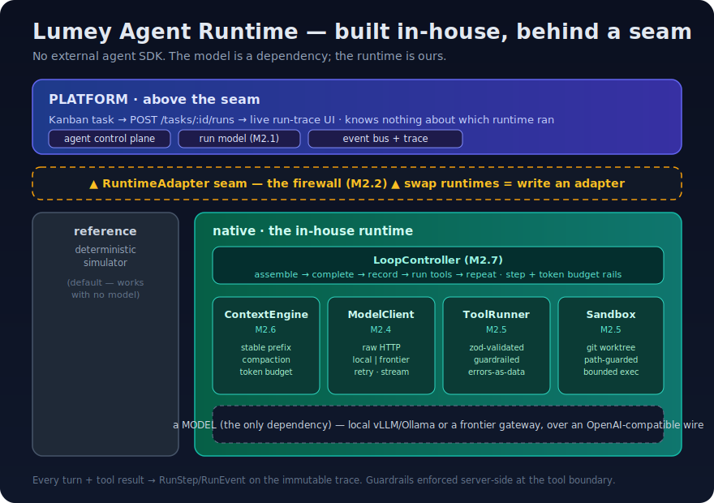
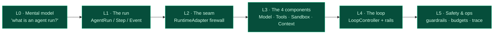
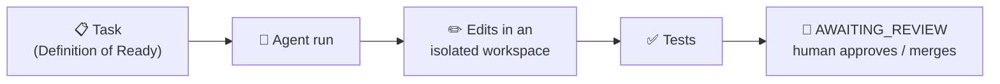
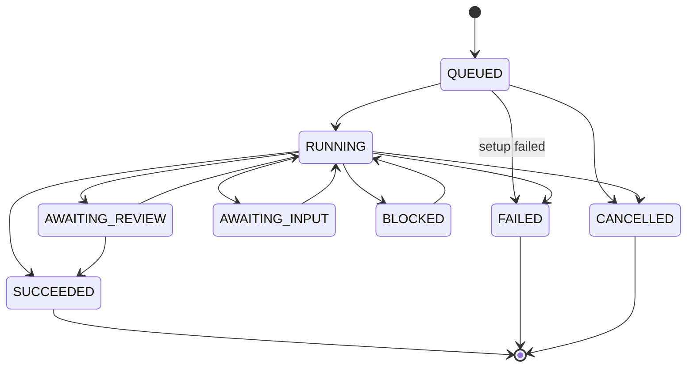
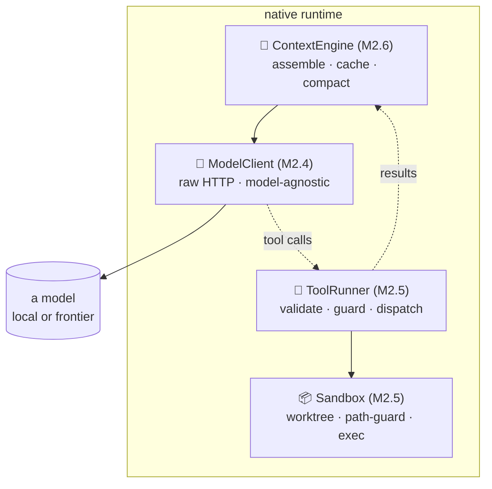
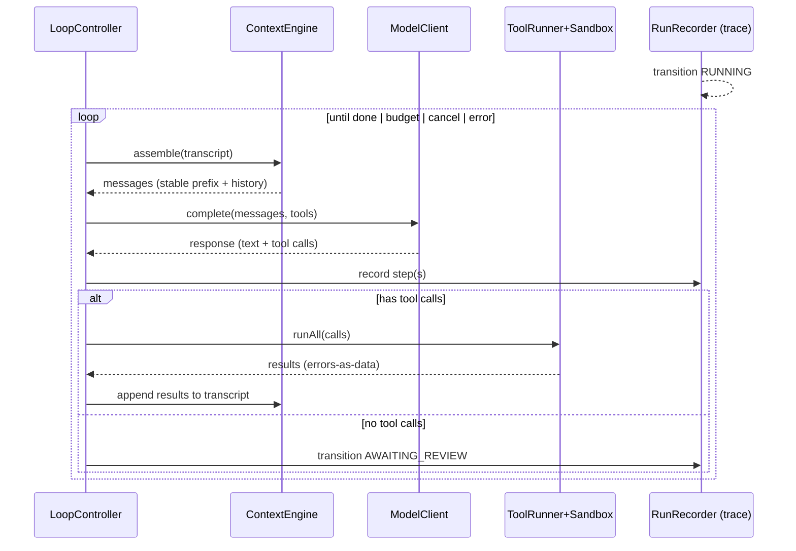
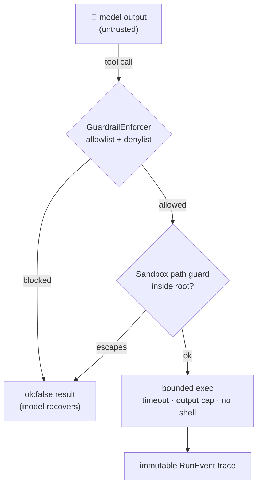
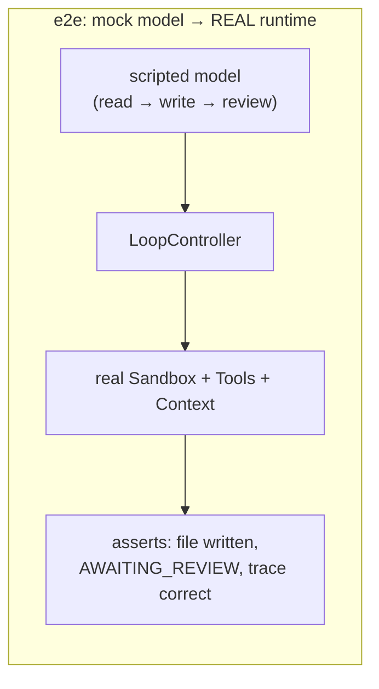

# The Lumey Agent Runtime & SDK — a learning guide

> **Who this is for.** Engineers new to Lumey who want to understand *how the
> agent actually works* — from a one-sentence mental model up to the internals —
> and reviewers/decision-makers who want to know **what we built, why, and how it
> differs from what's on the market.**
>
> **The one-sentence version.** Lumey runs AI software-engineering agents on a
> runtime we built **ourselves, from scratch** — the loop, the tools, the
> sandbox, the context engine — behind a stable seam, so no vendor owns our
> agent, it runs on-prem/air-gapped, and it works with any model.



---

## How to read this guide — the learning curve

You don't need all of it at once. Each level is self-contained; stop when you
know enough for what you're doing.



| Level | You'll understand | Time |
|---|---|---|
| **L0** | What a "run" is and the human-in-the-loop gate | 2 min |
| **L1** | How a run is recorded (the trace) | 5 min |
| **L2** | Why a *seam* makes building in-house low-risk | 5 min |
| **L3** | The four components and what each owns | 15 min |
| **L4** | The agentic loop that composes them | 10 min |
| **L5** | The safety, security, and cost model | 10 min |

---

## L0 · Mental model

An **agent run** is one attempt by an AI agent to complete one kanban task. It
reads the workspace, makes changes through tools, runs tests, and then **stops
and asks a human to review** — it never merges its own work. That last part is
the *done-gate*: agents propose, humans dispose.



## L1 · The run (the spine)

Every run is three records, written as the agent works (M2.1):

- **`AgentRun`** — the execution: status, model, summary, timing.
- **`RunStep`** — each action in order (`PLAN`, `TOOL_CALL`, `EDIT`, `COMMAND`,
  `TEST`, `REVIEW_REQUEST`).
- **`RunEvent`** — the immutable, append-only **trace** stream.

A validated **lifecycle** keeps a run honest — you can't skip work or resurrect
a finished run:



Every step and transition also publishes a `run.*` fact on the kernel event bus,
so observability and the live UI subscribe **without the runtime knowing they
exist**.

## L2 · The seam (why we can build in-house safely)

The whole runtime sits behind one interface — the **`RuntimeAdapter`** (M2.2):

```ts
interface RuntimeAdapter {
  id: string;
  capabilities(): { selfHosted; memory; outcomes; multiAgent };
  execute(ctx: RunContext): Promise<void>;  // QUEUED → review-park / terminal
  cancel(runId: string): Promise<void>;
}
```

An adapter translates *its* runtime's native execution into *our* run model. No
runtime-internal concept ever leaks above the line. We ship two:

- **`reference`** — a deterministic simulator (no model, no sandbox). The
  **default**, so the product demos with zero setup.
- **`native`** — our real in-house runtime (this guide).

**This is the key risk-reducer:** building our own loop is "write one more
adapter," not "rewrite the platform." The simulator covers the UI the entire
time the real runtime is being built.

## L3 · The four components

The `native` runtime is four from-scratch components. Each is a tested unit with
a single responsibility.



### 🧠 ModelClient — talk to any model, own nothing
*What:* one method, `complete(messages, tools) → response` (+ `stream`).
*How we built it:* a thin client over **raw `fetch`**, speaking the
OpenAI-compatible `/chat/completions` wire that vLLM, Ollama, llama.cpp **and**
frontier gateways all expose. Typed errors with retry flags, a request deadline,
bounded exponential-backoff retry on *retryable* failures only, and clean
caller-cancellation. *Why ours:* a vendor SDK assumes the vendor's model; we
route work to local models, so the client must be model-agnostic and ours to
tune. → `runtime/model/`

### 🔧 ToolRunner + 📦 Sandbox — the agent's guarded, isolated hands
*What:* the agent acts **only** through declared tools (`read_file`,
`write_file`, `edit_file`, `list_dir`, `grep`, `bash`) executed inside a
contained workspace.
*How we built it:*
- **Sandbox** = a **git worktree** (cheap per-run checkout) with two hard
  invariants: **path containment** (every path resolves inside the workspace —
  no `../etc/passwd`) and **bounded exec** (shell-free argv, timeout, output cap,
  abort).
- **Guardrails** = a server-side `bash` gate — a denylist (`sudo`, `rm -rf`,
  fork bombs, `curl|sh`, device writes; *deny always wins*) over an allowlist of
  binaries (empty ⇒ deny-by-default).
- **Tools** carry a single `zod` schema that both **validates** the model's
  arguments and **generates** the JSON-Schema we advertise to the model (one
  source of truth, no drift).
- **Errors are data:** an unknown tool, bad JSON, a schema miss, a blocked
  command, or a thrown handler all become an `ok:false` *result the model reads
  and recovers from* — never a crash. → `runtime/tools/`, `runtime/sandbox/`

### 📑 ContextEngine — where token cost is won
*What:* assemble each turn's prompt within a token budget.
*How we built it:* three levers — (1) **prefix-stable assembly** (the system
prompt is byte-identical every turn and always first, so prompt/KV caches hit);
(2) **context editing** (clip an oversized tool result so it can't dominate the
window); (3) **compaction** (summarize the oldest turns, keep recent ones
verbatim) with a pluggable summarizer. → `runtime/context/`

## L4 · The loop (it comes alive)

The **`LoopController`** (M2.7) composes the four into one agentic loop, and the
**`native` adapter** plugs that loop into the seam.



The loop owns the **safety rails**: a step ceiling and a token budget (the
circuit breaker against a runaway loop — both **hand off to human review**, they
don't crash), cooperative cancellation, and turning a terminal model error into
a `FAILED` run. Because every turn maps to a `RunStep`, the loop is **observable,
costed, and resumable by construction**.

## L5 · Safety, security & cost — the boundary view



- **Least privilege at the tool boundary** — enforced in-process, server-side;
  the agent can't reach around it.
- **Isolation** — a git-worktree workspace today (trusted local dev); the *same*
  `Sandbox` contract upgrades to a container (dropped caps, controlled egress)
  for untrusted execution.
- **Auditability** — every action is an immutable `RunEvent`; a run is
  reproducible from its pinned prompt + context + model.
- **Cost control** — the `ContextEngine` owns caching/compaction; the loop
  enforces token/step budgets.

---

## MoSCoW — what the SDK/runtime is (and isn't, yet)

Scope across the whole in-house runtime, as built through M2.7.

| | Item | State |
|---|---|---|
| **Must** | Runtime-neutral run model + validated lifecycle + immutable trace | ✅ M2.1 |
| **Must** | `RuntimeAdapter` seam (the firewall) | ✅ M2.2 |
| **Must** | Model-agnostic `ModelClient` over raw HTTP (no vendor SDK) | ✅ M2.4 |
| **Must** | `ToolRunner` + `Sandbox` with path containment + bounded exec | ✅ M2.5 |
| **Must** | Guardrails enforced at the tool boundary | ✅ M2.5 |
| **Must** | `ContextEngine` — budgeted, cache-stable prompt assembly | ✅ M2.6 |
| **Must** | `LoopController` — the agentic loop + step/token rails | ✅ M2.7 |
| **Must** | Wired as the `native` adapter, end-to-end tested | ✅ M2.7 |
| **Should** | Start-run API + live trace UI | ✅ M2.3 |
| **Should** | Streaming, retries, typed errors, cooperative cancel | ✅ |
| **Should** | Local **and** frontier model backends, env-resolved | ✅ M2.4/2.7 |
| **Could** | Container/air-gap sandbox hardening | ⏳ next |
| **Could** | Real repo workspace (worktree from project git), background exec | ⏳ next |
| **Could** | `run_tests` / `open_pr` finalize tools + git telemetry | ⏳ next |
| **Could** | Cross-run memory · Outcomes (rubric-graded) · multi-agent | ⏳ later |
| **Won't (now)** | A hosted/managed agent service — our wedge is *self-hosted* | ✗ |
| **Won't (now)** | Dependence on any external agent SDK / loop | ✗ by design |

## Use cases

1. **Autonomous ticket → PR.** An agent picks a Definition-of-Ready task,
   implements it in an isolated worktree, runs tests, and parks at
   `AWAITING_REVIEW` with a full trace — a human reviews the diff and merges.
2. **On-prem / air-gapped engineering.** A regulated customer runs the *entire*
   agent inside their network against a **local** model — no code or prompt ever
   leaves. A hosted runtime structurally cannot do this; ours can.
3. **Cost-routed work.** Triage/summarize/extract route to a cheap **local**
   model; hard coding routes to a **frontier** model — the *same* loop runs both
   because the loop is ours and model-agnostic.
4. **Bring-your-own-runtime.** A team prefers a different agent under the hood —
   they write one adapter; the kanban, trace, and review gate are unchanged.

## How Lumey differs from market / enterprise agent stacks

| Capability | Hosted agent services | Orchestration libs (LangGraph, CrewAI, AutoGen) | Agent apps (Devin, OpenHands) | **Lumey** |
|---|---|---|---|---|
| **Own the loop** | ✗ vendor's | partial (their framework) | ✗ their product | ✅ from scratch |
| **No vendor lock-in** | ✗ | partial | ✗ | ✅ |
| **On-prem / air-gap** | ✗ | depends | usually ✗ | ✅ first-class |
| **Model-agnostic** (local *and* frontier, one loop) | tied to vendor | ✅ | varies | ✅ |
| **Guardrails server-side at the tool boundary** | opaque | DIY | varies | ✅ enforced |
| **Immutable, swappable trace** (runtime-neutral) | vendor format | DIY | product UI | ✅ `RunEvent` |
| **Swap the whole runtime without app rewrite** | ✗ | ✗ | ✗ | ✅ the seam |
| **Product-native** (kanban, review gate, portals) | ✗ | ✗ | partial | ✅ |

**The thesis:** the agentic loop is commoditizing. Owning it — plus the
correction→training loop and an immutable trace — is the moat. A managed runtime
can deprecate, reprice, or gate us, and it can't run inside a customer's network.
Ours can, and it's the same loop whether the model is a local Gemma or a frontier
gateway.

## End-to-end testing — how we keep it honest

We test the runtime the way it runs, with a **mock model over real components**:
the scripted model emits tool calls, but the **Sandbox, ToolRunner, and
ContextEngine are the real implementations** — so an e2e test actually writes a
file to a real worktree and asserts the workspace changed and the trace + lifecycle
are correct.



The test pyramid behind that (≈140 runtime tests at the time of writing):

- **Unit** — each component in isolation (error classification, path-guard,
  guardrail allow/deny, zod→schema, token budgeting, compaction).
- **Integration** — a real **git-worktree lifecycle**; the loop over a real
  sandbox; the adapter wiring with the run service mocked.
- **Contract/lifecycle** — illegal transitions rejected; the seam's entitlement
  gate (401 enabled vs 404 disabled).
- **Whole repo stays green at every commit** — 1000+ backend tests, zero dead
  exports.

---

## Where to go next

- **Build plan & decision record:** [`in-house-sdk-and-runtime.md`](in-house-sdk-and-runtime.md)
- **Module reference:** [`../modules/AGENT-RUNTIME.md`](../modules/AGENT-RUNTIME.md)
- **Code:** `backend/src/modules/agent-runtime/` — `runtime/{model,tools,sandbox,context,loop}/`, `adapters/`, `runtimeAdapter.ts`
- **Part B (next chapter):** the **Lumey Platform SDK** — the schema-first
  TS + Python client every agent/integration uses to talk to the platform.
