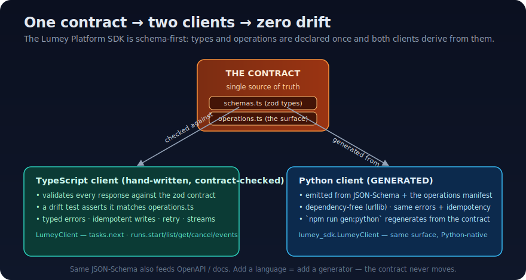
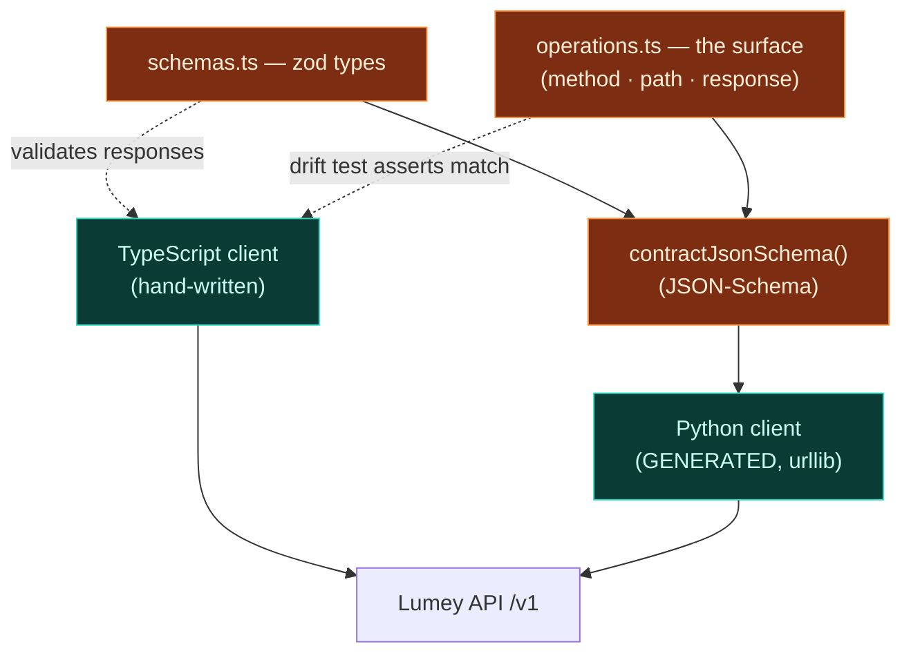

# The Lumey Platform SDK — a guide

> **Who this is for.** Anyone integrating with Lumey — building an agent,
> wiring an automation, or writing the Python client's caller — plus reviewers
> who want to know **what the SDK is, how it's built, and why it's different.**
>
> **One sentence.** The Lumey Platform SDK is the typed client agents and
> integrations use to talk to Lumey — **schema-first** (one contract → a
> TypeScript *and* a Python client, with zero drift), runtime-neutral, with
> actionable typed errors and idempotent writes.

This is **Part B** of the in-house SDK plan. Part A — the agent *runtime* that
*executes* work — is the
[runtime guide](lumey-runtime-sdk-guide.md). They meet at the run model: the
runtime drives runs in-process; the SDK reads/writes the same surface over the
network.



---

## The core idea: one contract, two clients

Hand-written client code drifts from the server the moment someone forgets to
update it. The SDK removes the opportunity: the **contract is declared once**,
and the clients derive from it.



- **TypeScript client** — hand-written for the best DX, but **validates every
  response against the zod contract** and is held to `operations.ts` by a
  **drift test**. If the client and the manifest disagree, CI fails.
- **Python client** — **generated** from the JSON-Schema + the operations
  manifest (`npm run gen:python`). Dependency-free (`urllib`), same error
  hierarchy, same idempotency. Adding a language is adding a generator; the
  contract never moves.

Both were verified **end-to-end against a live backend** (start a run → list →
fetch the trace).

## Quickstart

**TypeScript**
```ts
import { LumeyClient } from '@exargen/sdk';
const lumey = new LumeyClient({ baseUrl: 'http://localhost:3000/api/v1', token });

const task = await lumey.tasks.next();
if (task) {
  const run = await lumey.runs.start(task.id);              // idempotent
  for await (const ev of lumey.runs.events(task.id, run.id)) console.log(ev.type);
}
```

**Python** (generated, no dependencies)
```python
from lumey_sdk import LumeyClient
lumey = LumeyClient("http://localhost:3000/api/v1", token)

task = lumey.tasks.next()
if task:
    run = lumey.runs.start(task["id"])
    print(lumey.runs.get(task["id"], run["id"])["status"])
```

## How it's built — layer by layer

| Layer | File | What it owns |
|---|---|---|
| **Contract — types** | `contract/schemas.ts` | zod schemas; TS types are *inferred*, never hand-written. Runtime-neutral. |
| **Contract — operations** | `contract/operations.ts` | the canonical surface: each op's method, path, params, response shape. |
| **Codegen seam** | `contract/jsonSchema.ts` | renders the contract as JSON-Schema — the input the Python generator (and OpenAPI/docs) consume. |
| **Errors** | `errors.ts` | actionable typed hierarchy; `errorFromResponse` maps platform codes to classes. |
| **Transport** | `transport.ts` | `HttpTransport` (raw fetch): envelope unwrap, deadline, retry-on-retryable, idempotency key on writes; `MockTransport` for tests. |
| **Client** | `client.ts` | `LumeyClient` resources (`tasks`, `runs`), each response contract-validated. |
| **Generator** | `scripts/generatePython.ts` | pure `{ file → content }` from the contract; the CLI writes `python/lumey_sdk/`. |

### The "top-notch" properties (the bar from the plan)

- **Typed responses** — validated against the contract; you get typed data or a
  `LumeyContractError` (drift), never a silently-wrong object.
- **Actionable typed errors** — `BudgetExceededError`, `ApprovalRequiredError`,
  `ClarificationPendingError`, `LumeyAuthError`, … each with
  `status`/`code`/`runId`/`traceId`/`retryable`.
- **Idempotency on every write** — auto-attached `Idempotency-Key` (overridable);
  agents crash and resume safely.
- **Resilient transport** — per-request deadline + bounded retry on transient
  (429/5xx/network) failures only.
- **Resumable typed streams** — `runs.events()` yields trace events past a
  cursor and stops at a terminal status; reconnect with `sinceSeq` to resume
  exactly where you left off.
- **Testable without a server** — inject `MockTransport`; the SDK runs fully in
  memory (29 of the 34 tests need no network).

## MoSCoW — the SDK

| | Item | State |
|---|---|---|
| **Must** | Schema-first contract (zod → inferred TS types) | ✅ |
| **Must** | `LumeyClient`: pull work + drive/observe runs | ✅ |
| **Must** | Typed, actionable errors with run/trace ids | ✅ |
| **Must** | Idempotent writes; resilient transport | ✅ |
| **Must** | Tested without a server (mock transport) | ✅ |
| **Should** | JSON-Schema codegen seam + **generated Python client** | ✅ |
| **Should** | Operations manifest + **drift guard** (client ↔ manifest) | ✅ |
| **Should** | Resumable event stream (`runs.events`) | ✅ |
| **Should** | Verified end-to-end against the live backend (TS + Python) | ✅ |
| **Could** | More surface: `context.compile`, `hitl.*`, `git.link`, `kg.query` | ⏳ as endpoints land |
| **Could** | Server-push SSE behind `runs.events` (same cursor contract) | ⏳ |
| **Could** | Runtime validation in the Python client; published packages | ⏳ |
| **Won't (now)** | A bespoke wire format — we ride the platform's versioned `/v1` REST | ✗ |

## How it differs from market SDKs

| Property | Typical vendor SDK | Hand-rolled REST wrapper | **Lumey SDK** |
|---|---|---|---|
| **One contract, many languages** | per-language, can drift | ✗ | ✅ generated from one source |
| **Drift caught in CI** | rarely | ✗ | ✅ drift test + response validation |
| **Runtime-neutral** | tied to the vendor's agent | n/a | ✅ serves any agent/runtime/human |
| **Actionable typed errors w/ trace ids** | varies | ✗ | ✅ first-class |
| **Idempotent writes by default** | sometimes | DIY | ✅ every write |
| **Dependency-light** | often heavy | varies | ✅ zod (TS) · stdlib only (Python) |
| **Self-hostable / air-gap friendly** | usually SaaS-bound | ✓ | ✅ points at any base URL |

**Why it matters:** the SDK is how *other people's* agents and a customer's own
automations drive Lumey. Schema-first generation means a Python team and a
TypeScript team get the *same* contract, the same errors, and the same
idempotency guarantees — and the platform can add a language without rewriting a
client by hand.

## Testing

- **Unit (no network)** — transport (envelope, retry, error mapping,
  idempotency), client resources, the resumable stream, the JSON-Schema mapper,
  and the generator's output. `MockTransport` stands in for the server.
- **Drift guard** — every operation in the manifest is invoked through the real
  client and asserted to hit the declared method + path.
- **End-to-end** — both the TS and the generated Python client were run against
  a live backend: `runs.start → list → get` returns the real run trace.

```bash
npm run test --workspace=sdk     # 34 tests
npm run gen:python --workspace=sdk
python3 -c "import sys; sys.path.insert(0,'sdk/python'); import lumey_sdk; print('ok')"
```

## Where to go next

- **Package README / quickstart:** [`sdk/README.md`](../../sdk/README.md)
- **The runtime (Part A):** [`lumey-runtime-sdk-guide.md`](lumey-runtime-sdk-guide.md)
- **Build plan / decision record:** [`in-house-sdk-and-runtime.md`](in-house-sdk-and-runtime.md)
- **Roadmap:** more resources as endpoints land (`context.compile`, `hitl.*`,
  `git.link`, `kg.query`), SSE behind `runs.events`, published packages.
