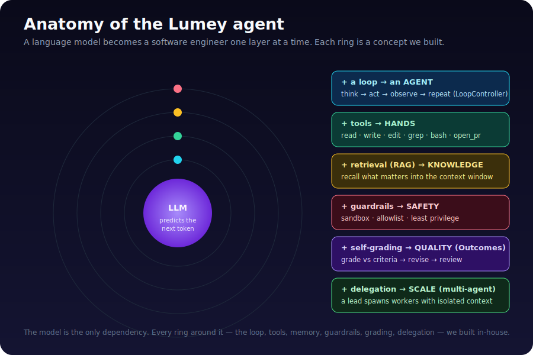
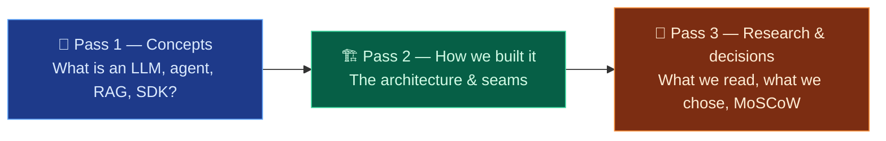
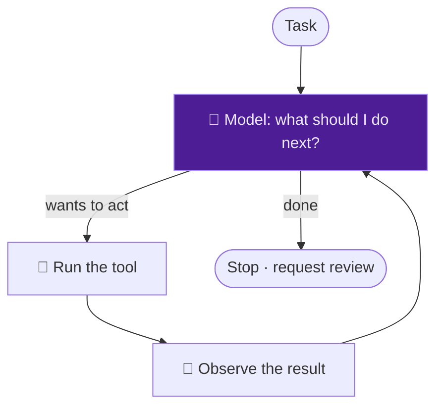
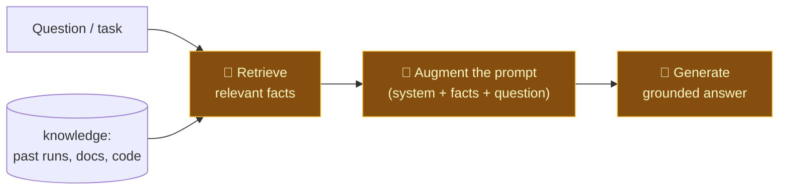
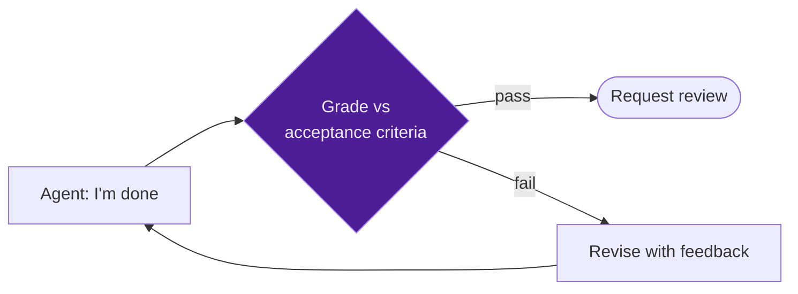
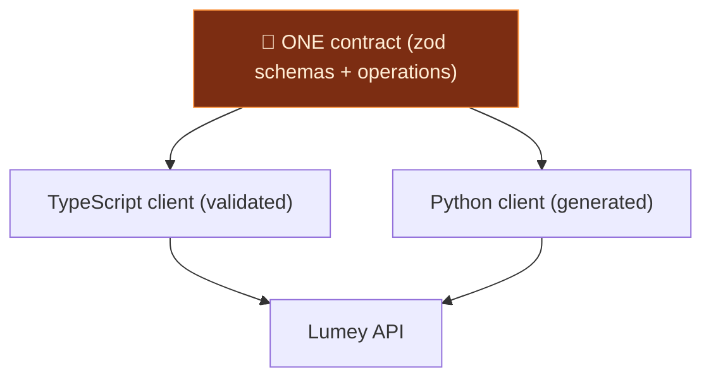

# 🎓 The Lumey Learning Guide — from "what's a token?" to a working AI software engineer

> **Who this is for:** you, learning the whole stack *by the example of a real
> product we built*. No prior AI background assumed. We start at "what is a
> language model" and end at multi-agent orchestration — explaining **every
> concept**, **how we built our version**, **what we researched first**, and
> **what we decided and why** (MoSCoW and all).
>
> **The 30-second version:** an AI agent is a language model wrapped in a *loop*
> that lets it *use tools*, *remember*, *check its own work*, and *delegate*.
> Lumey is that agent, built from scratch to run on **your own local models** —
> it picks up a kanban ticket, writes & tests code, opens a PR, and tags a human.

---

## How to read this

Three passes, pick your depth:

---

# Pass 1 — The concepts, from zero

## 1.1 What is a Large Language Model (LLM)?

An LLM is, at heart, a **next-token predictor**. You give it text; it predicts
the most likely next chunk of text (a "token" ≈ ¾ of a word), appends it, and
repeats. That's it. Everything else — "reasoning," "coding," "answering" — is an
*emergent behaviour* of doing that prediction extremely well over trillions of
examples.

Key vocabulary you'll see everywhere:

| Term | Plain meaning | Where it shows up in Lumey |
|---|---|---|
| **Token** | ~¾ of a word; the unit models read/write | we *count* them to measure cost (M2.11) |
| **Context window** | the model's short-term memory — how much text it can see at once | the `ContextEngine` packs this carefully (M2.6) |
| **Prompt** | the text you feed in | system prompt + transcript we assemble each turn |
| **Inference** | one run of the model (prompt → output) | one `ModelClient.complete()` call (M2.4) |
| **Temperature** | randomness dial (0 = deterministic, 1 = creative) | a knob on our completion request |

**The crucial limitation:** an LLM is *frozen* (it only knows its training data),
*stateless* (it forgets everything between calls), and *can't act* (it only emits
text). The next three concepts each fix one of those.

## 1.2 From a model to an **agent** — the loop

A raw LLM answers once and stops. An **agent** is an LLM placed inside a **loop**
that lets it take many steps toward a goal:

That "think → act → observe → repeat" cycle is **the** core idea of agents. In
Lumey it's the **`LoopController`** (M2.7): each iteration is one model turn; if
the model asks for a tool, we run it and feed the result back; when the model
stops asking for tools, it's done. We wrap that with **safety rails** (a step
ceiling and token budget) so it can never run away.

> 💡 *Why "agent" and not just "a smart chatbot"?* Because of the **loop + tools**.
> A chatbot talks. An agent *does* — it changes files, runs tests, opens PRs.

## 1.3 Tools & function calling — giving the model **hands**

A model can't touch your filesystem. So we give it **tools**: named functions
with a typed schema (e.g. `write_file(path, content)`). We *describe* the tools
to the model; when it wants to act, it emits a structured **tool call**
(`{name, arguments}`); we execute it and return the result.

In Lumey every action is a tool (`read_file`, `write_file`, `edit_file`, `grep`,
`bash`, `run_tests`, `git_commit`, `open_pr`, `delegate`). Making everything a
tool is a deliberate design choice — it means every action is **declared,
validated, guardable, and traced** (M2.5). Our `ToolRunner` validates the model's
arguments against a `zod` schema, runs the tool in a sandbox, and turns *any*
failure into a result the model reads and recovers from (errors are **data**, not
crashes).

> 🧪 *We saw this live:* a small 3B model sometimes **narrates** tool use in prose
> ("I'll write the file…") instead of emitting a real tool call. Stronger models
> emit structured calls reliably. The loop is the same; the model's competence
> differs — which is exactly why we kept the model swappable.

## 1.4 RAG — Retrieval-Augmented Generation (giving the model **knowledge**)

The model is frozen and forgetful. **RAG** fixes that: before asking the model to
generate, you **retrieve** the relevant facts (from a database, past runs, your
codebase) and **augment** the prompt with them. The model then **generates** an
answer grounded in *your* data, not just its training.

**Two flavours of "retrieve":**
- **Recency / keyword** — grab the most recent or matching rows. Simple, cheap.
- **Semantic (embeddings)** — turn text into a vector of numbers (an *embedding*)
  that captures *meaning*, then find the facts whose vectors are **closest** to
  the question's vector (cosine similarity). This finds *relevant* facts even when
  the words differ ("auth bug" matches "login fails").

**How Lumey does it:** our **cross-run memory** (M2.16) records what each run
learned; before a run, we *recall* the project's prior learnings and **augment**
the system prompt with them (the retrieval lives in the `ContextEngine` as a
stable "preamble"), so the agent doesn't relearn the project every time.

**M2.19 made it *semantic*** — recall now ranks memories by **cosine similarity**
of their **local embeddings** (`nomic-embed-text` via Ollama, 768 dimensions) to
the current task, so it surfaces *relevant* learnings even when the words differ.
We verified this live: *"fix the login auth bug"* scored **0.70** against *"resolve
the sign-in failure"* (same meaning) but only **0.37** against *"add a dashboard
chart"* (unrelated). It degrades gracefully to recency when no embedding model is
configured — and, true to our rule, the embeddings are computed by a **local**
model, never an online one.

> 🔑 RAG is *not* fine-tuning. Fine-tuning changes the model's weights (expensive,
> slow). RAG changes the *prompt* (instant, per-request). For "know my codebase,"
> RAG almost always wins.

## 1.5 Context engineering — where the **cost** is won

The context window is finite and **you pay per token, every turn**. So *how* you
pack the prompt is the single biggest lever on cost and quality. Our
**`ContextEngine`** (M2.6) owns three techniques:

1. **Prefix-stable assembly** — keep the opening bytes (system prompt) *identical*
   every turn so the model/KV cache can reuse them instead of re-reading the whole
   prompt. New content is always *appended*.
2. **Context editing** — clip a giant tool result so one `cat` of a huge file
   can't blow the window.
3. **Compaction** — when the conversation outgrows the budget, *summarize* the
   old turns into a note and keep the recent ones verbatim.

> 💸 *Intuition:* a dumb agent re-sends its entire history every turn → quadratic
> token cost. A well-engineered context grows *linearly* and caches its prefix.

## 1.6 Guardrails & sandboxing — **safety** by construction

An agent that can run `bash` is powerful and dangerous. Two layers protect you:
- **Sandbox** (M2.5) — the agent works inside an **isolated git worktree**, not
  your real repo. Every file path is forced to resolve *inside* that workspace
  (no `../../etc/passwd`), and every command runs with a timeout + output cap +
  **no implicit shell**.
- **Guardrails** — a server-side gate on `bash`: a **denylist** (sudo, `rm -rf`,
  fork bombs, `curl … | sh`) that *always* wins, over an **allowlist** of
  permitted binaries. Enforced where the agent can't reach around it.

This is **least privilege**: the agent gets exactly the blast radius it needs and
no more.

## 1.7 Outcomes — making the agent **check its own work**

A naïve agent declares "done" and stops — even if it's wrong. **Outcomes** (M2.17)
adds a self-grading step: when the agent thinks it's finished, a grader (the model
itself) checks the result **against the task's acceptance criteria**. If it fails,
the feedback is fed back and the agent **revises** — looping until it passes or a
budget is spent.

> 🎬 *We watched this happen live* on a local model: self-grade **FAIL → revise →
> self-grade PASS → request review**, right in the trace. That's the agent
> catching its own incomplete work.

## 1.8 Multi-agent — **scale** through delegation

For big or parallelizable work, one agent's context isn't enough. **Multi-agent**
(M2.18) lets a **lead** agent **delegate** a focused sub-objective to a **worker**
sub-agent. This is the **orchestrator-worker (hub-and-spoke)** pattern.

**The make-or-break detail (from the research — see Pass 3): context isolation.**
Each worker must get its *own* clean context window — *not* a shared one. We give
each worker a fresh loop seeded only with its objective, but the **same sandbox**,
so workers coordinate through the *filesystem* (like real engineers on a branch),
never by polluting each other's context.

## 1.9 The SDK — the **typed front door** to the platform

An **SDK** (Software Development Kit) is the typed client other programs use to
talk to your platform — so an agent (or a customer's automation) can "pull the
next task," "start a run," "stream the trace," without hand-writing HTTP calls.

Lumey's SDK (M3.1–M3.2) is **schema-first**: we declare the contract **once** (as
`zod` schemas), and **both** a TypeScript client *and* a generated Python client
come from it — so they can never drift. It has the properties senior engineers
demand: typed errors, idempotent writes, a resilient transport, and a **drift
test** that fails CI if the client and the contract disagree.

---

# Pass 2 — How **we** built it (the architecture)

The whole runtime is built **in-house, from scratch, with no external agent SDK**,
behind two stable **seams** (interfaces) that make everything swappable:

- **`RuntimeAdapter` seam** — the firewall between the platform and whatever
  *executes* a run. We ship a `reference` adapter (a deterministic simulator, so
  the UI always works) and our `native` adapter (the real loop). Swapping runtimes
  is "write a new adapter," never "rewrite the platform."
- **`ModelClient` seam** — the firewall between the runtime and the *model*. One
  HTTP client speaks the OpenAI-compatible wire format, so **any** model behind
  that format works — and (per our hard rule) we point it at **local models only**
  (Ollama/vLLM), never online frontier APIs.

The `native` runtime composes five from-scratch parts inside the loop:

| Part | Concept it embodies | Module |
|---|---|---|
| 🧠 **ModelClient** | inference (§1.1) | `runtime/model/` |
| 🔧 **ToolRunner + Sandbox** | tools + safety (§1.3, §1.6) | `runtime/tools/`, `runtime/sandbox/` |
| 📑 **ContextEngine** | context engineering + RAG (§1.4, §1.5) | `runtime/context/` |
| ♻️ **LoopController** | the agent loop + Outcomes (§1.2, §1.7) | `runtime/loop/` |
| 🤝 **delegate tool** | multi-agent (§1.8) | `runtime/tools/delegate.ts` |

> The deep dives live in [`docs/architecture/lumey-runtime-sdk-guide.md`](../architecture/lumey-runtime-sdk-guide.md)
> (runtime) and [`docs/architecture/lumey-sdk-guide.md`](../architecture/lumey-sdk-guide.md) (SDK).

---

# Pass 3 — The research & the decisions (the *why*)

## How we decide what to build — two honest modes

1. **Apply known patterns.** For settled problems (an HTTP retry client, a git
   sandbox, schema-first codegen), we build from well-established engineering
   knowledge + consistency with the existing codebase. Fast, low-risk.
2. **Research first.** For *contested, fast-moving* topics, we read primary
   sources before designing. We did this for **multi-agent**, where we pulled the
   [orchestration survey](https://arxiv.org/pdf/2601.13671) and the
   [context-pollution finding](https://arxiv.org/pdf/2604.07911) — which is *why*
   our workers get isolated context (a flat shared context collapses steering
   accuracy ~60%→21% as workers scale).

We tell you which mode each piece used, so you can calibrate trust.

## The big decisions (and their rationale)

| Decision | Why | Trade-off accepted |
|---|---|---|
| **Build the runtime in-house** (no external agent SDK) | own the loop = own the moat; no vendor can deprecate/reprice us | we build the hard parts ourselves |
| **Behind a `RuntimeAdapter` seam** | makes building in-house low-risk — `native` is just one more adapter | a little upfront interface design |
| **Local models only** | sovereign-AI / on-prem / air-gap is the product wedge | tune for slower, smaller models |
| **Everything is a tool** | uniform audit/guardrail/trace for every action | a tiny bit more ceremony per action |
| **Schema-first SDK** | one contract → TS + Python, zero drift | a codegen step to maintain |

## MoSCoW — how we scope every milestone

Every milestone is scoped with **MoSCoW** so we ship the *right* slice and never
gold-plate:

- **Must** — the core that makes the milestone real (and its tests).
- **Should** — high-value additions we include if they fit.
- **Could** — nice-to-haves explicitly deferred.
- **Won't (this increment)** — named out-of-scope, so the boundary is honest.

You'll find a `**Scope (MoSCoW)**` block in *every* module doc. It's how we keep
velocity high without scope creep — and how a reviewer instantly sees what a
change does and does **not** do.

---

# Pass 4 — The journey (experiences & lessons)

Real lessons from building this, in order:

- **Start lean.** We *removed* ~140 files and 40+ DB models to strip the platform
  to its agentic core before adding anything. Less surface = faster, safer build.
- **Green at every commit.** 1097 backend + 39 SDK tests, **zero dead code**,
  enforced continuously. A milestone isn't "done" until it's green, documented,
  and committed.
- **Seams pay off later.** Building the `RuntimeAdapter` + `ModelClient`
  firewalls *first* meant that lighting up a **real local model** later was a
  one-line config change — not a rewrite.
- **The live run taught the most.** Pointing the finished runtime at a local
  Ollama model, we watched the **Outcomes loop self-correct** (FAIL → revise →
  PASS) — *and* learned that small models **narrate** tool use instead of calling
  tools, and that a local 7B's cold-load (~30–60s) needed a **bigger timeout**
  than a fast API. Both are real-world truths you only find by running it.
- **Document as you go.** Every module has a doc; the whole path lives in
  [`CHANGELOG.md`](../../CHANGELOG.md). Future-you (and your teammates) will thank
  present-you.

---

## 🧭 Where this goes next

- **Semantic RAG** — upgrade memory recall from recency to **local embeddings**
  (e.g. `nomic-embed-text` via Ollama) for meaning-based retrieval.
- **Parallel fan-out** — let the lead run several workers at once.
- **Richer tools** — more of the engineer's toolkit, all guardrailed.

## 📚 Keep learning

- Runtime deep-dive: [`lumey-runtime-sdk-guide.md`](../architecture/lumey-runtime-sdk-guide.md)
- SDK deep-dive: [`lumey-sdk-guide.md`](../architecture/lumey-sdk-guide.md)
- The build decision record: [`in-house-sdk-and-runtime.md`](../architecture/in-house-sdk-and-runtime.md)
- The full build log: [`CHANGELOG.md`](../../CHANGELOG.md)
- Per-module detail: [`docs/modules/`](../modules/)

*This guide grows with the product — new concepts get a new section as we build them.*
