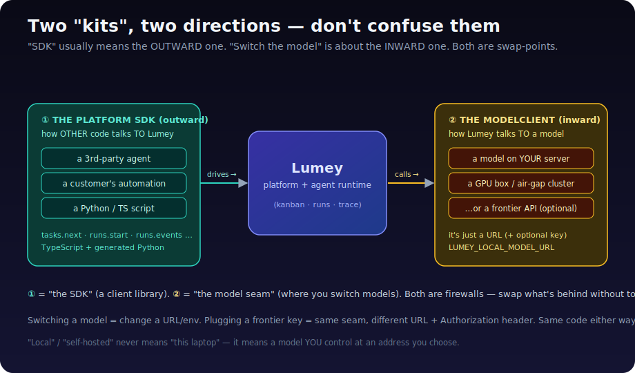
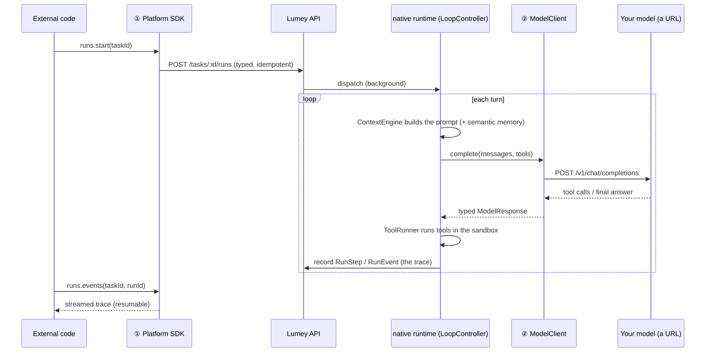

# 🧩 Understanding SDKs — deeply, and how Lumey switches models

> You asked three things: *what is an SDK*, *how many do we have*, and *can we
> swap any model / plug in a frontier key*. The trick to answering all three is
> one clarification most people miss — so we start there.



---

## Part 0 — The clarification: there are **two** "kits", pointing opposite ways

When people say "the SDK," they almost always mean a **client library** that lets
*other* code talk *to* a system. But "switch the model" is about a *different*
kit — the one Lumey uses internally to talk *to* a model. They're easy to confuse
because both are "a thing you swap." Keep them separate:

| | ① The **Platform SDK** | ② The **ModelClient** |
|---|---|---|
| **Direction** | **outward** — other code → Lumey | **inward** — Lumey → a model |
| **Who uses it** | a 3rd-party agent, a customer's automation, a script | the Lumey runtime itself |
| **What it is** | a published client library (TS + Python) | an internal interface (a "seam") |
| **The everyday name** | "the SDK" | "the model provider / the model layer" |
| **What you swap** | nothing — *you* use it as-is | **the model** (local URL, or frontier key) |

So: **"the SDK"** = ①. **"switch any model / add a frontier key"** = ②. This doc
covers both — and the good news is, ② is a *config* change, never a code one.

---

## Part 1 — What is an SDK, *really*?

**SDK = Software Development Kit.** Literally a *kit* of parts that makes building
against a system easy, safe, and fast. The best metaphor is flat-pack furniture:

- An **API** is the raw contract — "here are the screw-holes and the spec sheet."
  You *could* build from raw lumber and a spec, but it's slow and error-prone.
- An **SDK** is the *kit*: pre-cut parts, the right screws, an instruction
  booklet, and an Allen key. Same furniture, far less pain.

Concretely, an SDK usually bundles:
1. **A typed client** — methods like `runs.start(taskId)` instead of hand-rolled
   `fetch('/api/...')`.
2. **Types/models** — so your editor autocompletes and the compiler catches
   mistakes.
3. **Cross-cutting plumbing** — auth, retries, pagination, idempotency, error
   mapping — done once, correctly.
4. **Docs + examples** (and often a **mock** so you can test without the real
   server).

### SDK vs API vs Library vs Framework (the four words people mix up)

| Term | One-liner | Who's in control |
|---|---|---|
| **API** | the *contract* — the endpoints/messages a system accepts | — |
| **Library** | code *you call* to do a job (e.g. `lodash`, `zod`) | **you** call it |
| **Framework** | code that *calls you* — you fill in the blanks (e.g. React, Express) | **it** calls you ("inversion of control") |
| **SDK** | a *kit* (usually a library + types + tools) for building against a specific platform/device | you call it |

> 💡 An SDK is often *a library + extras*. "Library" describes the shape; "SDK"
> describes the purpose (a kit for *this* platform).

---

## Part 2 — The **kinds** of SDKs (a taxonomy)

There isn't "one type of SDK." Here are the main families, with examples and what
you build with each:

1. **API / client SDKs** — wrap a remote HTTP service.
   *Examples:* Stripe SDK, Twilio, AWS SDK, GitHub Octokit.
   *You build:* an app that *uses* that service. **← Lumey's Platform SDK is this kind.**

2. **Platform / runtime SDKs** — build apps that run on a platform.
   *Examples:* Java JDK, .NET SDK, the Node.js runtime + libs.
   *You build:* programs for that runtime.

3. **Device / OS SDKs** — build for specific hardware/OS.
   *Examples:* iOS SDK, Android SDK, console game SDKs.
   *You build:* native apps.

4. **Framework / plugin SDKs** — extend a host application.
   *Examples:* VS Code Extension API, Shopify App SDK, Unity.
   *You build:* extensions/plugins inside someone else's app.

5. **AI Agent SDKs** *(the new family)* — build/run AI agents.
   *Examples:* Claude Agent SDK, OpenAI Agents SDK, LangChain/LangGraph, CrewAI.
   *You build:* agents — but you adopt **their** loop, **their** abstractions,
   often **their** model assumptions.

> 🔑 **Why Lumey deliberately did NOT use an agent SDK (family 5).** Adopting one
> means renting your agent's brain from a vendor — their loop, their lock-in,
> their model coupling, and (critically) **you can't run it fully on your own
> hardware**. We built the agent *runtime* ourselves (the loop, tools, sandbox,
> memory) and shipped only a **family-1 Platform SDK** so others can drive Lumey.
> The runtime is the moat; the SDK is the front door.

---

## Part 3 — So, **how many SDKs does Lumey have?**

**One.** A single **Platform SDK** — shipped as **two language clients**
(TypeScript + Python), both generated from **one contract**.

People miscount this as "two SDKs." It's not:

```
            ┌─────────────── ONE contract (zod schemas + operations) ───────────────┐
            │                                                                        │
   TypeScript client  ◄──── validated against it          Python client  ◄──── generated from it
   (@exargen/sdk)                                          (lumey_sdk)
```

Two *languages*, one *SDK*. (Think "the AWS SDK" — it exists for JS, Python, Go,
Java… still "the AWS SDK.")

**What is *not* an SDK in Lumey:**
- The **agent runtime** is the *engine*, not an SDK. You don't "use" it as a
  library; it *executes* runs behind the platform.
- The **ModelClient** (② above) is an *internal seam*, not a published kit. It's
  how the runtime reaches a model. We'll deep-dive it next, because that's your
  "switch the model" question.

So the honest tally: **1 outward Platform SDK (2 languages)** + **1 inward model
seam (not an SDK, but the swap-point for models).**

---

## Part 4 — How **our** Platform SDK is different from most

Most SDKs (Stripe, Twilio) are **hand-written per language** — which is why they
drift, lag the API, and behave subtly differently across languages. Ours is built
on three uncommon principles:

| Principle | What it means | Why it matters |
|---|---|---|
| **Schema-first & generated** | one `zod` contract → TS types + a *generated* Python client | the languages can't drift; add a language = add a generator, not a rewrite |
| **Drift-guarded** | a test invokes the TS client against the operations manifest and fails CI on any mismatch | the client can never silently diverge from the contract |
| **Runtime-neutral** | the schemas name no vendor/runtime concept | the *same* client serves our `native` runtime, a 3rd-party agent, or a human tool |

Plus the senior-engineer table-stakes: **typed errors** (`BudgetExceededError`,
`ApprovalRequiredError`, each carrying a `runId`/`traceId`), **idempotent writes**
(every write auto-attaches an idempotency key — agents crash and retry
constantly), a **resilient transport** (deadline + retry on transient failures
only), a **resumable event stream** (`runs.events`, resume from a cursor), and a
**mock transport** so integrators test with zero network. It's **dependency-light**
— `zod` in TS, *stdlib only* in Python.

> Contrast with **agent SDKs** (family 5): those hand you an *agent loop* and tie
> you to a model. Ours hands you a *platform client* — the loop stays ours, the
> model stays yours.

---

## Part 5 — The model layer, end to end (your real question)

This is ② — the `ModelClient` seam — and it's where **"switch any model / plug in
a frontier key"** lives.

### 5.1 The seam (one interface, everything behind it is swappable)

```ts
interface ModelClient {
  readonly model: string;
  complete(req): Promise<ModelResponse>;     // one buffered turn (tool calls)
  stream(req): AsyncIterable<ModelStreamChunk>; // token-by-token
}
```

The runtime only ever calls `complete()`/`stream()`. It has **no idea** whether
the bytes come from a laptop, your GPU server, an air-gapped cluster, or a hosted
gateway. That ignorance is the feature.

### 5.2 The universal adapter: the OpenAI-compatible wire format

Here's the unlock. There's a *de-facto standard* HTTP shape —
`POST /v1/chat/completions` with `{model, messages, tools}` — that **almost
everything speaks**: Ollama, vLLM, llama.cpp, LM Studio, *and* hosted gateways
(OpenAI, Together, Groq, OpenRouter, even Anthropic's compat endpoint). Because
our one `HttpModelClient` speaks exactly that, **any of them works with the same
code.** A model becomes "a URL + a model name (+ maybe a key)."

> 🔑 **"Local" / "self-hosted" never means "this laptop."** It means a model *you*
> control, at an address *you* choose. Your server, a rented GPU box, an on-prem
> cluster — all "local" in the sovereign sense. To Lumey it's just
> `LUMEY_LOCAL_MODEL_URL`.

### 5.3 Switching a **self-hosted** model — change a URL/name

```bash
# Point at the model you host (your server, a GPU box, an on-prem cluster):
LUMEY_LOCAL_MODEL=qwen2.5-coder:7b
LUMEY_LOCAL_MODEL_URL=https://models.your-company.internal/v1   # ← anywhere you host

# Swap to a different self-hosted model? Change ONE value. No code change:
LUMEY_LOCAL_MODEL=deepseek-coder-v2
```

Same runtime, same loop, same SDK — a different model. That's the whole point of
the seam.

### 5.4 Plugging in a **frontier** model (the option — local stays the focus)

```bash
LUMEY_MODEL_BACKEND=frontier
LUMEY_FRONTIER_URL=https://api.your-gateway.com/v1     # any OpenAI-compatible gateway
LUMEY_FRONTIER_MODEL=<the hosted model id>
LUMEY_FRONTIER_API_KEY=sk-...                          # attached as a Bearer header
```

Same seam, different URL + an `Authorization` header. The resolver
(`modelClientFromEnv`) fails *loud* if you select `frontier` without the keys, so
you never send an unauthenticated request that 401s mid-run.

> **Lumey is local-first by design** (sovereignty is the wedge), but the door to a
> hosted model is open — one config block, no code.

### 5.5 The resolver (`modelClientFromEnv`) — the whole switch in one place

```
LUMEY_MODEL_BACKEND = "local" (default) ──► createLocalModelClient({ model, baseUrl })
                    = "frontier"        ──► createFrontierModelClient({ model, baseUrl, apiKey })
```

Local models also get a **generous timeout** (300s default — a self-hosted model
can be slower than a hosted API), overridable with `LUMEY_MODEL_TIMEOUT_MS`.
Code: `backend/src/modules/agent-runtime/runtime/model/factory.ts`.

> ✅ This is exercised by unit tests with an **injected `fetch`** (no live model):
> `factory.test.ts` proves the local default, the frontier build, and the
> fail-loud guard. So we verify model-switching **without running an LLM.**

---

## Part 6 — The full request lifecycle (truly end to end)

How a single instruction flows from the *outward* SDK, through Lumey, out the
*inward* model seam, and back as a trace:



Notice the two seams doing their jobs: **①** lets *anything* start a run; **②**
lets that run hit *any* model. Neither end knows or cares what the other end is.

---

## Part 7 — Hands-on: the config knobs

| Variable | Picks | Note |
|---|---|---|
| `LUMEY_LOCAL_MODEL` | the self-hosted model id | e.g. `qwen2.5-coder:7b` |
| `LUMEY_LOCAL_MODEL_URL` | **where** it's hosted | your server/GPU box; default is a local Ollama URL |
| `LUMEY_MODEL_BACKEND` | `local` (default) or `frontier` | the switch |
| `LUMEY_FRONTIER_URL` / `_MODEL` / `_API_KEY` | a hosted model | only when `=frontier` |
| `LUMEY_MODEL_TIMEOUT_MS` | per-request deadline | local default 300s |
| `LUMEY_EMBED_MODEL` | embedding model for semantic memory | also via the same model seam |

**Code map:**
- ② model seam: `backend/src/modules/agent-runtime/runtime/model/` (`types.ts`,
  `httpModelClient.ts`, `factory.ts`).
- ① Platform SDK: `sdk/` (TS: `sdk/src/`, generated Python: `sdk/python/`).
- Deeper still: the [SDK guide](../architecture/lumey-sdk-guide.md),
  the [runtime guide](../architecture/lumey-runtime-sdk-guide.md), and the
  [local-model performance guide](../architecture/local-model-performance.md).

---

## Part 8 — Glossary (quick reference)

- **API** — the contract a system exposes.
- **SDK** — a kit (typed client + types + tools) for building against a system.
- **Library** — code you call. **Framework** — code that calls you.
- **Platform SDK (①)** — Lumey's outward client (TS + Python).
- **ModelClient (②)** — Lumey's inward model seam; where you switch models.
- **Self-hosted / local model** — a model *you* run at a URL you control (not
  necessarily this laptop).
- **Frontier model** — a hosted model behind an API key; in Lumey, a *pluggable
  option*, not the default.
- **OpenAI-compatible wire format** — the de-facto `/v1/chat/completions` shape
  that makes models interchangeable.
- **Seam / firewall** — an interface that lets you swap what's behind it without
  touching the rest.

*This guide grows with the build. Next, when you host a model on your server,
we'll point `LUMEY_LOCAL_MODEL_URL` at it and run end-to-end against your box.*
