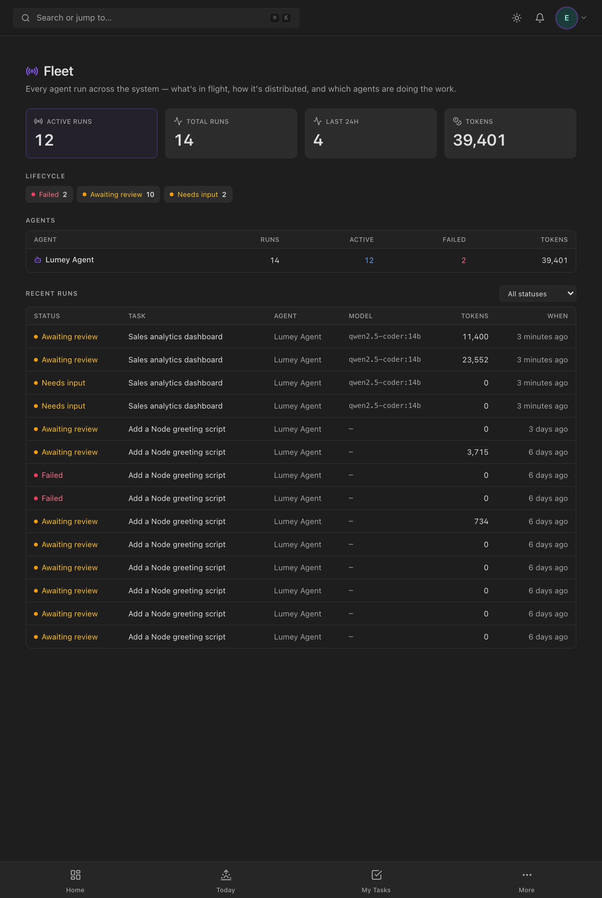

# Fleet dashboard module (Enterprise Phase 5)

The operator's cross-system view of the agent fleet. Where the [HITL inbox](HUMAN-IN-THE-LOOP.md)
answers *"what needs me?"*, the Fleet console answers *"how is the whole fleet
doing?"* — what's in flight, how runs are distributed across the lifecycle, 24h
throughput, and a per-agent rollup of work, token spend, and failures.

Code: service `backend/src/services/fleet.service.ts` · API
`modules/agent-runtime/fleet.handler.ts` (`/fleet/overview`, `/fleet/runs`) · UI
`frontend/src/pages/admin/FleetPage.tsx`.

*The console at a glance: four headline stats (active / total / last‑24h / tokens),
a **Lifecycle** strip showing the live status distribution, an **Agents** rollup
(runs · active · failed · tokens per agent), and a filterable **Recent runs** table
(status · task · agent · model · tokens · when). Each task links through to its
board card.*

## What it shows

- **Headline stats** — `active` (non‑terminal runs in flight), `total`, runs in the
  **last 24h**, and total tokens across the visible fleet.
- **Lifecycle distribution** — a count per `RunStatus`, so an operator sees at a
  glance whether work is flowing (RUNNING/SUCCEEDED) or piling up
  (AWAITING_REVIEW/AWAITING_INPUT/FAILED).
- **Per‑agent rollup** — for each agent: total runs, how many are active, how many
  failed, and cumulative tokens. The fast read on "which agent is doing the work,
  and is any agent erroring?".
- **Recent runs** — the newest runs across the fleet with task/agent/model/token
  context, filterable by status.

## Visibility

Identical to the rest of the agent surface (and the inbox): runs are agent work,
so the fleet is **empty for a viewer who can't see agents**, and otherwise scoped
to projects the viewer can access — admins with `project.view_all` see everything;
everyone else is scoped to their project memberships. Enforced server‑side in
`fleet.service.runScope`, so an unauthorised caller never sees another team's runs.

## API

| Method | Path | Returns |
|---|---|---|
| GET | `/api/v1/fleet/overview` | totals, token sum, `byStatus[]`, `last24h`, top‑8 `agents[]` |
| GET | `/api/v1/fleet/runs?status=&limit=&offset=` | recent runs (task + agent + model + tokens), newest first |

Built from `AgentRun` with a few `groupBy` aggregations — no new tables. The
overview polls (10s) so the console stays roughly live without a dedicated stream.

## Testing

Service units cover the visibility gate (no‑agents → empty, no‑memberships →
empty), the project‑scoped query for a non‑admin, the aggregation math (lifecycle
totals, 24h throughput, per‑agent rollup), and the run mapping.

## Not yet built (Phase 5 remainder)

Per‑project / per‑task‑type routing policy (today routing is per‑agent + default);
health‑probed automatic model fallback. And the honest scaling caveat from the
plan: true fleet **scale** eventually needs a **durable job queue** to replace the
in‑process `runExecutor` — this read/console ships first, which is the immediately
useful part.
