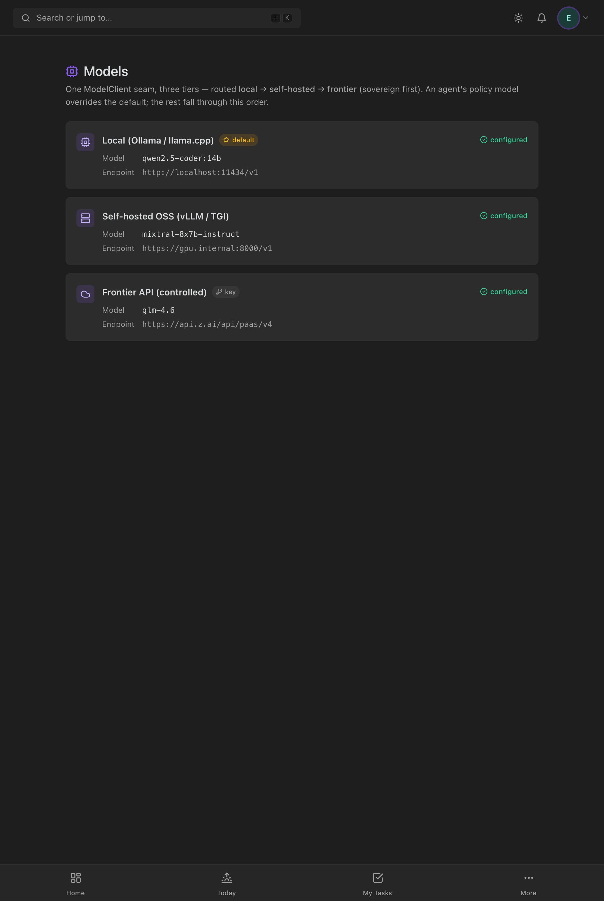

# Model routing module (Enterprise Phase 5)

The sovereign, **local-first** model strategy — three options, one seam. Every run
infers through a single `ModelClient`; this module decides *which* model serves it.

Code: registry `backend/src/modules/agent-runtime/runtime/model/modelProviders.ts`
· client builder `runtime/model/factory.ts` (`modelClientForContext`) · API
`models.handler.ts` (`GET /models/providers`) · UI
`frontend/src/pages/admin/ModelsPage.tsx`.

## The three tiers

| Tier | What | Auth | Env |
|---|---|---|---|
| **LOCAL** | Ollama / llama.cpp on the box — air-gap, zero cost, the default direction | none | `LUMEY_LOCAL_MODEL`, `LUMEY_LOCAL_MODEL_URL?` |
| **SELF_HOSTED** | an OSS LLM on your own server (vLLM / TGI), OpenAI-compatible | optional bearer | `LUMEY_SELFHOSTED_MODEL`, `LUMEY_SELFHOSTED_URL`, `LUMEY_SELFHOSTED_API_KEY?` |
| **FRONTIER** | a hosted frontier gateway — controlled, opt-in | API key (required) | `LUMEY_FRONTIER_MODEL`, `LUMEY_FRONTIER_URL`, `LUMEY_FRONTIER_API_KEY` |

`listModelProviders(env)` always returns **all three** (an unconfigured tier shows
as a setup target), in priority order, each marked `configured` + `isDefault`.

## Routing

`selectProvider(providers, preferredModel?)`:
1. **preferred model** — if `AgentPolicy.model` (P4.2) names a model whose tier is
   configured, use it (per-agent routing);
2. else the **default tier** — `LUMEY_MODEL_BACKEND` (`local`/`self-hosted`/
   `frontier`) when that tier is configured, else the first configured in priority
   order;
3. else the **first configured** tier — **sovereign first** (local → self-hosted →
   frontier), so frontier is only ever the last resort.

The native adapter calls `modelClientForContext({ preferredModel: policy.model })`;
`factory.ts` builds the concrete `HttpModelClient` for the chosen tier (reading its
secret from env, with a tier-appropriate timeout: local 300s, self-hosted 200s,
frontier 120s). Throws loudly at run start — not mid-request — when nothing is
configured.

## API

`GET /api/v1/models/providers` (admin, `analytics.view_portfolio`) →
the tier descriptors. **Redacted**: model id, label, and a credential-stripped
endpoint host only — never an API key or a `user:pass@` URL.

## UI

The **Models** admin page: each tier as a card with its kind icon, model,
endpoint, a configured/not-configured badge, a "key" chip for key-gated tiers, and
a "default" star on the routed-by-default tier — the sovereign strategy at a
glance.

*All three tiers configured here: **Local (Ollama)** serving `qwen2.5-coder:14b`,
**Self-hosted OSS (vLLM/TGI)** serving `mixtral-8x7b-instruct`, and **Frontier API**
serving `glm-4.6` (marked ⭐ default · 🔑 key). The endpoints are shown
credential-stripped; the API key is never sent to the client. This is exactly the
"connect any OpenAI-compatible model" story — e.g. GLM‑4.6 drops into the frontier
(or self-hosted) tier with no code change.*

## Testing

Pure-function units cover the whole router: all-three-on-empty-env, configured +
default detection, the `LUMEY_MODEL_BACKEND` hint (honoured only when that tier is
configured, else first-configured wins), `selectProvider` (preferred-model match →
default → first-configured → null), and **credential redaction** of the endpoint.
Factory units confirm a preferred model routes to the right tier and falls back.
Verified live (all three tiers configured, local default, no key in the payload).

## Not yet built (Phase 5 remainder)

A **Fleet dashboard** (live runs across the system, queue depth, per-agent
cost/error rollups); per-project / per-task-type routing policy (today routing is
per-agent + default); health-checked **automatic** fallback (today fallback is
config-order, not liveness-probed).
