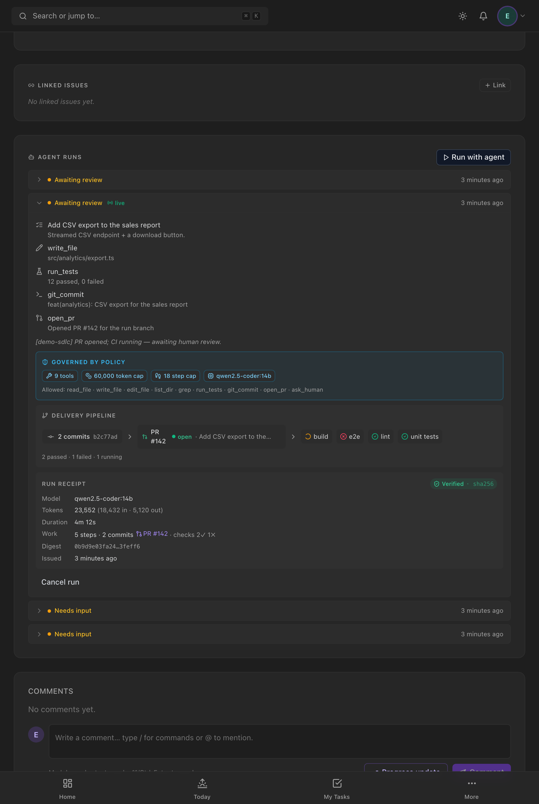

# SDLC graph module (Enterprise Phase 3)

Turns "a PR was opened" into a **living view of the agent's delivery** — commits →
pull request → CI checks — on the task card. Once a human approves the PR (Phase
2), they want to watch it land; this is what they watch.

Code: service `backend/src/services/runSdlc.service.ts` · recorded from
`modules/agent-runtime/runtime/tools/finalize.ts` (via the native adapter) +
`services/githubIntegration.service.ts` (webhooks) · read API
`modules/agent-runtime/agentRun.handler.ts` (`…/sdlc`) · UI
`frontend/src/components/tasks/SdlcPipeline.tsx`.

## Data model

| Model | Purpose | Idempotent on |
|---|---|---|
| `RunCommit` | a commit the agent made on its run branch (`sha`, `message`, `branch`) | `(runId, sha)` |
| `RunPullRequest` | the PR the run opened (`externalId`, `number`, `url`, `title`, `branch`, `state`) | `externalId` |
| `RunCheck` | one CI check on that PR (`name`, `status`, `conclusion`, `url`) | `externalId` |

Enums: `PrState` (OPEN/MERGED/CLOSED), `CheckStatus` (QUEUED/IN_PROGRESS/COMPLETED),
`CheckConclusion` (SUCCESS/FAILURE/NEUTRAL/CANCELLED/TIMED_OUT/ACTION_REQUIRED/
SKIPPED/STALE — null until COMPLETED). Migration `20260628030000`.

## How it's populated

**From the agent's tools** (recorded by the native adapter as they fire):
- `git_commit` → `onCommitted` → `recordRunCommit`.
- `open_pr` → `onOpened` → `recordRunPullRequest` (alongside the existing
  task-level PR link).

**From GitHub webhooks** (`handlers/githubIntegration.handler.ts`):
- `pull_request` → `updateRunPullRequestState` keeps the run PR's state current.
  Done *before* the task-@-ref early-return, since a run PR is linked by its
  provider id, not by mentioning a task in the body.
- `check_run` → `processCheckRunEvent` attaches the check to the run's PR, matched
  by the check's **head branch** (the run branch `lumey/run-<id>`) and **scoped to
  the webhook's project** so a branch name can't cross projects. Idempotent on the
  GitHub check id, so GitHub's repeated created/in_progress/completed deliveries
  converge.

Everything is idempotent — webhook replays and tool retries never duplicate.

## API

`GET /api/v1/tasks/:id/runs/:runId/sdlc` (taskAccess-gated) →
`{ commits[], pullRequest | null, checks[] }` — the latest PR and its checks,
assembled by `getRunSdlc`.

## UI — the Delivery pipeline strip

`SdlcPipeline` renders `commits → PR → checks` as one horizontal flow on the run
card (self-hides until there's delivery activity):
- **PR** badge coloured by state (open = green, merged = violet, closed = red),
  clickable to GitHub.
- **Checks** as pills coloured by status/conclusion (✓ green pass · ✗ red fail ·
  ◌ amber spinner running · — neutral), each clickable, with a `N passed · N
  failed · N running` summary.

It refetches on the run's SSE signal, so a human watches CI go green before they
merge.

*The run card after the agent committed and opened a PR: the trace (write → test →
commit → `open_pr`), then the **Delivery pipeline** strip — `2 commits b2c77ad →
PR #142 (open) → [build ◌ running] [e2e ✗] [lint ✓] [unit tests ✓]`, summarised
"2 passed · 1 failed · 1 running". (Below it, the governance **Run receipt** —
documented in [GOVERNANCE.md](GOVERNANCE.md).)*

## Testing

Service units cover record/assemble + the `check_run` mapping (status/conclusion
enums, branch+project scoping, idempotent upsert, no-match → null) and the
PR-state no-op-when-not-a-run-PR path. Verified live in the browser against a
fixture (commits → PR #142 → 4 checks). No live LLM / no live GitHub needed — the
tool callbacks and webhook processors are exercised at their seams.

## Not yet built (later)

A PR/check **pipeline strip on the task card itself** (not just the run card), a
`RunArtifact` model (build outputs / coverage), and merge-from-the-card.
