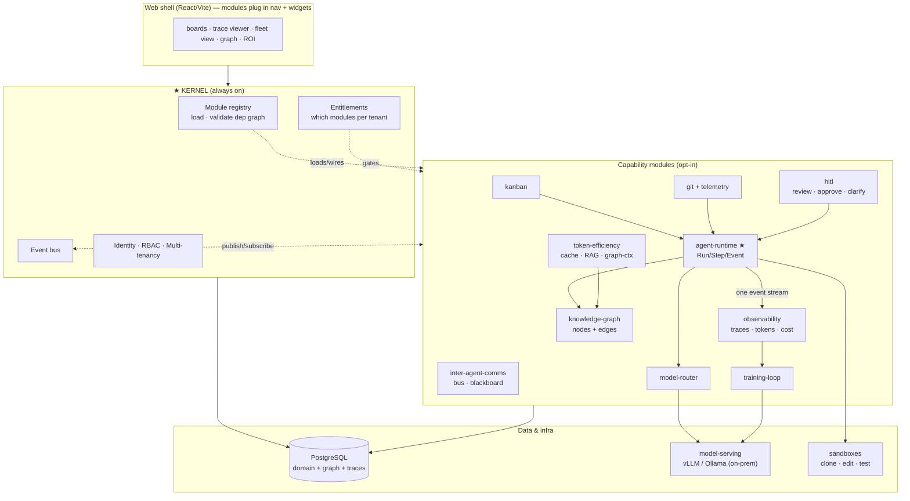
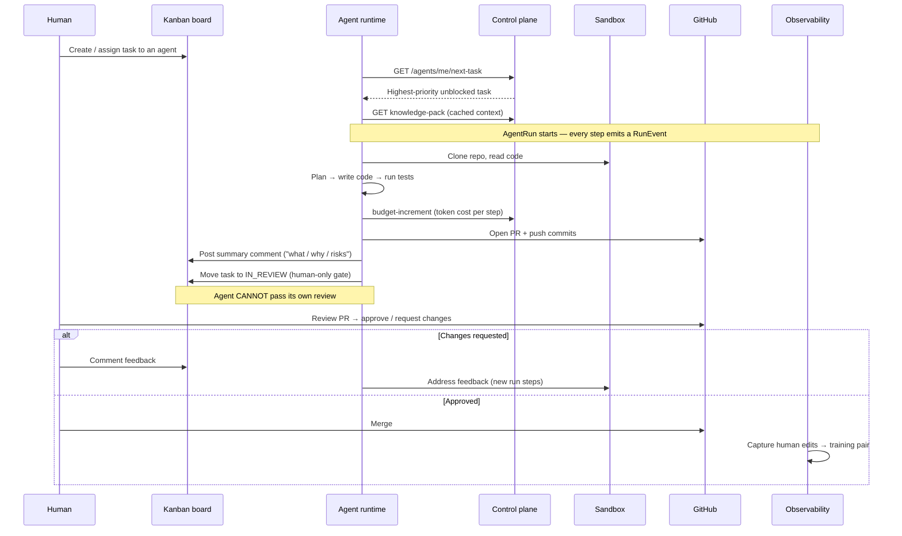

# Lumey — Command Center v2.0

**An enterprise-grade, modular, agentic engineering platform.**
Agents pick up work from a kanban board, write and test code, open PRs, document
their reasoning, and tag a human to review — all under full observability, token
accounting, and human-in-the-loop control, powered by a mix of locally-deployed
and frontier models.

**Plug-and-play from day one.** Lumey is a small always-on **kernel** plus a set of
**opt-in capability modules**. One customer enables *kanban + AI agents*; another
enables *kanban + observability*; another enables *everything*. You install — and
pay for — exactly what you need.

> Status: **Planning / Phase 0**. This document is the canonical architecture and
> roadmap. It supersedes Command Center v1.0, which is feature-heavy and customised
> to Exargen. Lumey is a fresh, lean, modular, sellable rebuild.

---

## 1. Vision & goals

Lumey turns a project board into an **autonomous engineering team you can watch,
steer, and trust** — assembled from modules the customer chooses:

1. **Agentic action** — an agent assigned a kanban task clones the repo, writes
   code, runs tests, opens a PR, comments its reasoning, and requests human review.
2. **Observability** — every agent run is a trace: steps, tool calls, token usage,
   cost, diffs, test results. Nothing happens off the record.
3. **Company knowledge graph** — people, agents, projects, repos, tasks, commits,
   decisions and docs as a queryable graph that also serves as token-efficient context.
4. **Inter-agent communication** — agents coordinate, hand off work, and share
   context instead of each re-deriving it.
5. **Efficient token usage** — caching, graph-as-context, retrieval, and tiered
   model routing keep cost low and predictable.
6. **Local model deployment** — run agents on on-prem models; human corrections
   become training data that makes those models better. The core differentiator.
7. **Lean, modular & sellable** — strip the Exargen-specific bloat; ship a focused,
   stable, **plug-and-play** platform.

---

## 2. Modularity is the architecture (Principle #0)

Plug-and-play is not a feature — it is the shape of the whole system, committed to
on day one. Everything below is designed to honour it.

### 2.1 Kernel + modules

- **Kernel (always on):** the minimal substrate every deployment needs —
  identity · RBAC · multi-tenancy · **module registry** · **event bus** ·
  **entitlements** (which modules a tenant has licensed) · database access.
- **Modules (opt-in):** every capability — kanban, git, agent-runtime,
  observability, knowledge-graph, hitl, model-router, inter-agent-comms,
  token-efficiency, training-loop, model-serving.

### 2.2 The module contract

Each module is a package that ships a **manifest**:

```ts
{
  id: 'agent-runtime',
  version: '1.0.0',
  dependsOn: ['kanban', 'git'],                     // hard — won't load without these
  enhances:  ['observability', 'knowledge-graph'],  // soft — emits events they consume
  provides: {
    routes,        // API routes to mount
    migrations,    // tables this module owns
    events,        // { emits: [...], consumes: [...] }
    ui,            // { nav, routes, widgets } the web shell plugs in
    jobs,          // background workers / schedules
  },
  entitlement: 'agent-runtime',                     // licensing / pricing key
}
```

### 2.3 Three rules that make it truly plug-and-play

1. **Modules talk only through the event bus + declared contracts** — never direct
   imports. A module that isn't installed simply has no subscriber for its events.
   No crashes, no `if-installed` branching scattered through the code.
2. **Graceful degradation** — the knowledge graph ingests *whatever* event sources
   are present; observability traces *whatever* emits. Fewer modules → fewer node
   types and thinner traces, never errors.
3. **The kernel validates the dependency graph at boot** — enabling `agent-runtime`
   without `git` is reported clearly, not discovered at runtime.

### 2.4 Module dependency graph

| Module | Hard deps | Soft (ingests / enhances) | Entitlement |
|---|---|---|---|
| **kernel** | — | — | always-on |
| kanban | kernel | — | `kanban` |
| git | kernel | — | `git` |
| comments | kernel | — | `comments` |
| notifications | kernel | — | `notifications` |
| **agent-runtime** | kanban, git | comments, notifications | `agent-runtime` |
| hitl | kanban | agent-runtime | `hitl` |
| model-router | kernel | — | `model-router` |
| observability | kernel | agent-runtime, kanban, git | `observability` |
| knowledge-graph | kernel | agent-runtime, git, kanban, docs | `knowledge-graph` |
| token-efficiency | knowledge-graph | agent-runtime | `token-efficiency` |
| inter-agent-comms | agent-runtime | — | `inter-agent-comms` |
| model-serving (local) | model-router | — | `model-serving` |
| training-loop | observability, hitl | model-serving | `training-loop` |

### 2.5 Example bundles (== pricing tiers)

| Tier / customer | Modules |
|---|---|
| **Board** | kernel + kanban + comments + notifications |
| **Board + Agents** | + git + agent-runtime + model-router + hitl |
| **Board + Observability** | + observability (+ agent-runtime to make it rich) |
| **Platform** | everything above + knowledge-graph + token-efficiency + inter-agent-comms |
| **Enterprise (on-prem)** | Platform + model-serving (local) + training-loop, air-gapped |

Modular packaging *is* the pricing model: customers enable — and pay for — exactly
what they use.

### 2.6 Database stance (day-one tradeoff)

Day one uses **single Postgres + single Prisma schema**, with tables **owned** by
each module and **gated at runtime by entitlement** ("soft" modularity). This
delivers the full plug-and-play *experience* — UI, API, nav and pricing all adapt —
without the complexity of dynamically composing DB schemas. Because module
boundaries stay clean, the path to "hard" modularity later (per-module migrations,
separately deployable services) stays open. (See gate **G5**.)

---

## 3. Finalised decisions

| Area | Decision |
|---|---|
| Architecture | **Modular plug-and-play**: always-on kernel + opt-in modules over an event bus, per-tenant entitlements (see §2) |
| Repository | New `lumey` repo, fresh git history, ported selectively from the v1 snapshot |
| Database | PostgreSQL. **Knowledge graph = nodes/edges tables in Postgres** (no Neo4j) |
| Stack | Keep v1 stack: **Bun · Prisma · Express · React/Vite · TypeScript** |
| Reuse | v1's "Layer 2 agent control plane" — `userType=AGENT`, budget tracking, `next-task` picker, knowledge-pack, the IN_REVIEW human-only done-gate, `Activity` log |
| Layout | Monorepo: `apps/*` (kernel shells) + `packages/modules/*` (capability modules) |

### Tear-down (cut from v1 — ~45 models, ~half the schema)

Timesheets · CMS / content-engine · pulse · productivity tracker · LMS / courses ·
device / MDM (+ the entire `windows-agent/`) · HR / leave.

### Keep (the spine, refactored into modules)

Identity & RBAC (→ kernel) · projects, kanban / tasks (→ kanban module) ·
comments · notifications · GitHub integration (→ git module) · the agent control
plane (→ agent-runtime module).

---

## 4. Capability pillars (each is a module)

| # | Pillar / Module | Launch tier |
|---|---|---|
| 1 | **agent-runtime** — Run / Step / Event execution model | Core |
| 2 | **observability** — traces, token usage, cost | Core |
| 3 | **hitl** — review gate, approvals, clarification loop | Core |
| 4 | **git** + telemetry — commits, PRs, tests linked to runs | Core |
| 5 | **knowledge-graph** (Postgres) | Core |
| 6 | **inter-agent-comms** — message bus + shared memory | Fast-follow |
| 7 | **token-efficiency** — caching, graph-as-context, tiered routing | Fast-follow |
| 8 | **training-loop** — corrections → fine-tune local models (the moat) | Fast-follow |
| 9 | **safety/failure** — circuit breakers, guardrails, secret-scan | Woven into every module |
| 10 | **model-router** + **model-serving** | Core to the sell |

---

## 5. High-level architecture



**Why this shape.** The **kernel** is the only thing always present; every
capability is a module wired in at boot and gated by entitlement. Among the
modules, **agent-runtime is the keystone** — the rest are readers or dependencies
of it:

- **observability** is a *reader* of the runtime's event stream — not a separate build.
- **knowledge-graph** is *fed by* that stream plus git/doc ingestion, and doubles as
  the **token-efficiency** layer (query 3 relevant decisions, don't dump 20 docs).
- **model-router** sits *underneath* the runtime as a dependency.
- **training-loop** *reads* observed human corrections and *feeds* model-serving.

Build the kernel + the event bus + the agent-runtime once; every other module plugs
into that seam.

---

## 6. The agentic run — end-to-end flow



---

## 7. New data model (Phase 1+)

Designed Postgres-first; the graph lives in the same database. Each group is owned
by the module named.

**agent-runtime / observability**
- `Agent` — identity, capabilities, default model, autonomy level
- `AgentRun` — one task execution: status, outcome, model, duration, retries
- `RunStep` — a tool call / edit / command / test (OpenTelemetry-style span)
- `RunEvent` — the structured trace record (supersedes/extends v1 `Activity`)
- `TokenUsage` — prompt / completion / cache tokens + cost, per step → rollups
- `ModelEndpoint` / `RoutingPolicy` — local vs frontier routing config

**hitl**
- `ReviewRequest` — agent → human, approve / request-changes
- `ApprovalGate` — gate before merge / deploy / protected-path edits
- `ClarificationRequest` — agent asks, run blocks until a human answers

**git telemetry**
- `AgentCommit` · `AgentPullRequest` — linked commit → run → task
- `DiffMetric` — files touched, lines ±, per run
- `TestRun` — tests written, pass/fail, coverage delta

**knowledge-graph**
- `KnowledgeNode` — people · agents · projects · repos · tasks · PRs · commits · files · decisions · docs · runs
- `KnowledgeEdge` — `authored`, `producedBy`, `touches`, `influences`, `reviewed`, …

**inter-agent-comms**
- `AgentMessage` — direct agent→agent mailbox
- `Blackboard` — shared per-project/epic scratchpad (pooled context)
- `TaskHandoff` — structured handoff with distilled context

**training-loop**
- `Correction` — captured human edit/rejection → training pair for local models

**kernel**
- `Tenant` · `ModuleInstallation` · `Entitlement` — who has which modules enabled

---

## 8. Repository layout

```
lumey/
  apps/
    api/                      # kernel host: boots registry, mounts enabled module routes
    web/                      # web shell: renders nav/widgets from enabled modules
  packages/
    kernel/                   # registry · event bus · entitlements · IAM · tenancy
    modules/
      kanban/                 # each module: manifest.ts + routes + migrations + ui + events
      git/
      agent-runtime/          # ★ the keystone engine
      hitl/
      observability/
      knowledge-graph/
      token-efficiency/
      inter-agent-comms/
      model-router/
      model-serving/
      training-loop/
    db/                       # prisma schema (composed from module migrations) + client
    shared/                   # types · event contracts · the module SDK
  agents/                     # agent definitions / prompts / skills
  infra/                      # docker · vLLM/ollama serving
  docs/
    ARCHITECTURE.md           # this file
    ROADMAP.md
```

Every module folder follows the same shape: `manifest.ts` declares deps,
entitlement, routes, migrations, events, and UI contributions. Adding a capability
= adding a folder; the kernel discovers and wires it.

---

## 9. Roadmap (phased)

### Phase 0 — Foundation + kernel
Init `lumey` repo + monorepo layout · **build the kernel** (module registry, event
bus, entitlements, IAM/tenancy) · port the spine into the first two modules
(`kanban`, `git`) · delete cut modules · Postgres + slimmed Prisma schema.
**Output:** kernel boots, validates a dependency graph, and runs `kanban` + `git`
as the first plug-in modules.

### Phase 1 — agent-runtime + observability (keystone)
`AgentRun` / `RunStep` / `RunEvent` + token/cost capture + trace viewer, as modules
plugged into the kernel. One **end-to-end vertical slice**: assign task → agent runs
→ PR + summary comment → human review gate.
**Output:** the demo that proves Lumey — and proves the module model (enable/disable
observability without touching agent-runtime).

### Phase 2 — git/test telemetry + deeper HITL
Commit/PR/test runs linked to runs · review-request → approve/request-changes ·
approval gates · clarification loop.

### Phase 3 — knowledge-graph + token-efficiency
Postgres nodes/edges fed by the event stream · graph-as-context + prompt caching +
RAG + tiered routing. (Modules 5 + 7 ship together — the graph *is* the compression layer.)

### Phase 4 — inter-agent-comms
Message bus · shared blackboard · orchestrator agent that decomposes epics → assigns.

### Phase 5 — model-serving + training-loop
Model router · local serving · capture human corrections as training pairs → improve
on-prem models.

> **Safety / failure layer** (circuit breakers, secret-scan, guardrails, runaway &
> deadlock detection, poison-task escalation) is woven into **every** module, not
> bolted on at the end.

---

## 10. Open decisions (gates)

| # | Decision | Gates | Recommendation |
|---|---|---|---|
| G1 | **Local-model role** — router vs all-local vs frontier-only | Phase 5, token-efficiency routing | Router: frontier codes, local does triage/summarise/extract |
| G2 | **Sandbox model** — Lumey spawns containers vs external runtime polls `next-task` | Phase 1 runtime shape | TBD — settle before Phase 1 tables |
| G3 | **Launch line** — which modules are v2.0-launch | Scope | Modules 1–5 + safety + model-router; 6/7/8 fast-follow |
| G4 | **ICP / buyer** — dev teams vs regulated enterprise | Tear-down edge cases, sell story | TBD |
| G5 | **Modularity depth** — soft (runtime-gated, one schema) vs hard (per-module migrations / deployables) | DB strategy | Soft on day one; preserve the path to hard |

---

## 11. Problems we are explicitly planning for

Runaway / infinite-loop detection · deadlock detection (cyclic task deps) ·
poison tasks (auto-escalate after N attempts) · stale context (repo re-sync) ·
hallucination guardrails (verify paths/commands before executing) ·
secret leakage (scan agent output before commit — reuse `.gitleaks.toml`) ·
blast-radius limits + rollback · fleet-wide circuit breaker ·
graduated autonomy (trust earned from PR-acceptance rate) · reproducibility/audit
(pin prompt + context + model version per run).

---

## 12. Value & differentiation

Capabilities are table stakes; these are why Lumey is worth more:

- **Air-gapped on-prem** — local models unlock the premium, low-competition
  regulated segment (gov / defence / health / finance) that hosted tools can't serve.
- **Self-improving per-customer model** — the training-loop tunes the on-prem model
  to *their* codebase; leaving means giving that up. A moat no API-only tool has.
- **Knowledge graph as engineering intelligence** — DORA metrics, bus-factor,
  "who/what touches this file," impact maps. Sells *before* a buyer trusts agents to
  merge — a low-friction wedge.
- **Outcome-based pricing** — per merged PR / task, surfaced by the ROI dashboard.
  Capture value instead of leaving it on the table.
- **Modular packaging** — land with one module, expand into the platform. Every
  module is a pricing lever and an upsell path.
